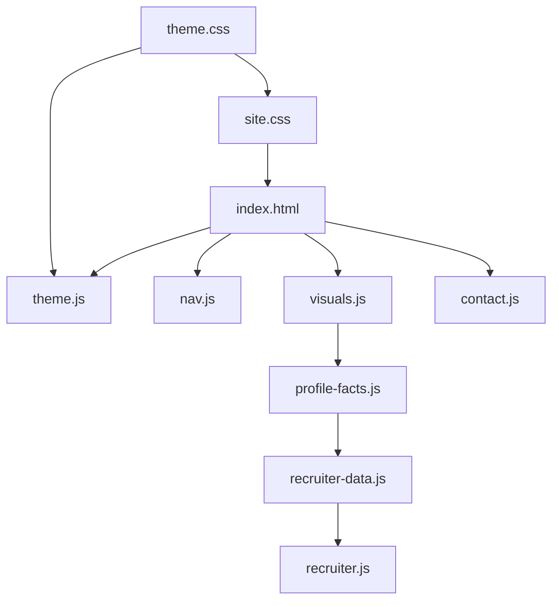

# Claude Prompt — Portfolio Repository Architecture & File Breakdown

**Repo:** `AnimeshPandey.github.io`  
**Canonical site:** https://anmshpndy.com  
**Stack:** Static HTML · CSS custom properties · vanilla JS · GitHub Pages (no build step)  
**Status:** May 2026 — visual layer, recruiter briefing (`profile-facts.js`), contact handler, header-only recruiter chrome, writing section polish, SW `ap-v21`.

**Use this document when:** refactoring, adding features, onboarding an agent, or deciding which file to touch.

**Exhaustive human reference:** [`docs/ARCHITECTURE.md`](../../docs/ARCHITECTURE.md) — layers, LOC tables, DOM IDs, maintainer workflows, verification checklist. **Update that file** when architecture changes materially; keep this prompt aligned (layer rules, anti-patterns, script matrix).

---

## Your role

You are a **staff-level frontend architect** maintaining a **zero-dependency static portfolio**. Before changing code:

1. Map the request to the correct **layer** and **file contract** below.
2. Preserve **progressive enhancement**, **mobile-first CSS**, and **WCAG 2.1 AA**.
3. Prefer extending existing modules over new files unless separation is clear.
4. Never introduce a bundler, framework, or npm dependency without explicit owner approval.
5. Do not put implementation prompts under `docs/` — only under `.claude/prompts/`.

---

## Documentation layout

| Path | Purpose |
|------|---------|
| `docs/ARCHITECTURE.md` | Human technical reference (full breakdown) |
| `docs/README.md` | Docs index |
| `.claude/prompts/*.md` | Agent implementation prompts (**this file**) |
| `README.md` | Quick start, deploy, human checklist |

---

## System overview

```text
┌─────────────────────────────────────────────────────────────────┐
│  GitHub Pages (static-pages.yml) → repo root as artifact        │
│  CNAME: anmshpndy.com · secrets injected via CI sed             │
└────────────────────────────┬────────────────────────────────────┘
                             │
     ┌───────────────────────┼───────────────────────┐
     ▼                       ▼                       ▼
  HTML pages            Shared assets            Discovery / PWA
  (content shells)      (theme + site + JS)      (SEO, SW, manifest)
```

| Concern | Primary artifacts |
|---------|-------------------|
| **Content & semantics** | `index.html`, article `*/index.html`, `404.html` |
| **Design tokens** | `assets/theme.css` |
| **Layout & components** | `assets/site.css` |
| **Core behavior (all pages)** | `assets/theme.js`, `assets/nav.js` |
| **Homepage enhancements** | `assets/visuals.js`, `assets/contact.js` |
| **Lazy recruiter bundle** | `recruiter.css` → `profile-facts.js` → `recruiter-data.js` → `recruiter.js` |
| **Lazy eggs (tiered)** | `eggs.css` + `eggs-data.js` + one `eggs-{mobile\|tablet\|desktop}.js` |
| **Offline shell** | `sw.js` (`CACHE = ap-v21`), `site.webmanifest` |
| **Crawl & identity** | `sitemap.xml`, `robots.txt`, JSON-LD in `<head>` |

---

## Eight design principles

1. **Zero build step** — repo root = deployable artifact; `git push main` deploys.
2. **Progressive enhancement** — HTML is complete without JS; CSS works without JS except FOUC guard in `<head>`.
3. **Mobile-first** — base 320px+; `min-width` breakpoints in `site.css`; 44×44px targets; 16px form inputs on mobile.
4. **Separation of concerns** — see layer table below; do not bleed responsibilities across files.
5. **Accessibility by default** — skip link, focus traps, `aria-*`, reduced-motion paths, `aria-live` for dynamic feedback.
6. **SEO discipline** — canonical host `https://anmshpndy.com/`; sitemap/OG/JSON-LD agree.
7. **Performance** — `defer` scripts; lazy recruiter/eggs; capability gates in `visuals.js`; bump SW cache on asset changes.
8. **Minimal scope** — smallest correct diff; no unrelated refactors.

---

## Layer model

| Layer | Files | Loads on |
|-------|-------|----------|
| **L0 HTML** | `index.html`, articles, `404.html` | Always |
| **L1 Tokens** | `theme.css` | All pages |
| **L2 Presentation** | `site.css` | All pages |
| **L3 Chrome JS** | `theme.js`, `nav.js` | All pages |
| **L4 Homepage JS** | `visuals.js`, `contact.js` | Homepage only |
| **L5 Recruiter** | lazy chain above | On recruiter toggle / `?recruiter=1` |
| **L5 Eggs** | lazy eggs chain | After `visuals.js` `initEggs()` |
| **L6 PWA** | `sw.js` | Homepage registers SW |

### File contracts (must not violate)

| File | Owns | Must not own |
|------|------|----------------|
| `theme.css` | CSS variables, `[data-theme]`, fonts import | Section layout, components |
| `site.css` | Reset, header/nav, sections, writing, contact, recruiter chrome, visual hooks | Token definitions |
| `theme.js` | `localStorage.theme`, `dataset.theme` | Nav, canvas, recruiter, forms |
| `nav.js` | Mobile menu, focus trap, scroll-spy, sticky header, progress bar, `#back-top`, `#yr` year update | Hero effects, canvas, cards, recruiter, contact |
| `visuals.js` | `caps`, hero canvas + hero chrome, scroll reveal, stat count-up, card UX, eggs/recruiter lazy loaders, hire shortcut, theme wink, SW register | Recruiter panel render (delegates to `recruiter.js`); nav chrome |
| `contact.js` | `#contactForm` Web3Forms POST, `#copyEmailBtn` | Recruiter, eggs |
| `profile-facts.js` | `window.__PROFILE_FACTS` | Editorial prose |
| `recruiter-data.js` | `window.__RECRUITER_BRIEF` derived from facts | Hand-edited dates/scores |
| `recruiter.js` | Panel render, scan, copy, focus trap | Homepage section copy |
| `recruiter.css` | Panel sheet, scan, section cards | Global tokens |

---

## Script loading matrix

| Page | `theme.js` | `nav.js` | `visuals.js` | `contact.js` | Recruiter lazy | SW register |
|------|:----------:|:--------:|:------------:|:--------------:|:--------------:|:-----------:|
| `index.html` | ✅ | ✅ | ✅ | ✅ | on demand | ✅ |
| Articles | ✅ | ✅ | ✗ | ✗ | ✗ | ✗ |
| `404.html` | ✅ | ✅ | ✗ | ✗ | ✗ | ✗ |

**Homepage inline (allowed):** FOUC theme snippet in `<head>`.

**Third-party:** Google Fonts; Cloudflare Web Analytics (`YOUR_CF_BEACON_TOKEN` → CI inject).

---

## Repository map (current)

```text
AnimeshPandey.github.io/
├── index.html                          # Homepage (~1.2k LOC)
├── 404.html
├── fundamentals-of-functional-javascript/index.html
├── how-well-do-you-know-this/index.html
├── assets/
│   ├── theme.css · site.css
│   ├── theme.js · nav.js · visuals.js · contact.js
│   ├── profile-facts.js · recruiter-data.js · recruiter.js · recruiter.css
│   ├── eggs.css · eggs-data.js · eggs-mobile.js · eggs-tablet.js · eggs-desktop.js
│   └── og-image.png · og-image.svg
├── sw.js                               # CACHE = ap-v21
├── docs/ARCHITECTURE.md                # Human reference
├── .claude/prompts/                    # Agent prompts (this folder)
└── README.md
```

---

## Content authority

When sources conflict:

```text
1. index.html visible copy          ← edit first
2. animesh_pandey_resume.tex        ← align with (1); owner approval for resume-only edits
3. profile-facts.js                 ← structured mirror of (1)
4. recruiter-data.js                ← derived at runtime; never source of truth
5. eggs-data.js                     ← decorative; must not contradict headline stats
6. JSON-LD / FAQ                    ← update when (1) changes
```

**Canonical employment (verify after edits):** Lifesight `Sept 2025 – Present`; Tekion `Apr 2022 – Sept 2025`; Vassar Labs visible; education **CPI 7.9**.

---

## Recruiter briefing (architecture summary)

**Shell in `index.html`:** `#rm-panel`, `#rm-scan`, `#rm-body`, minimize/copy, footer CTAs.

**Lazy chain:** `recruiter.css` → `profile-facts.js` → `recruiter-data.js` → `recruiter.js`.

**Entry points (shipped):**

| ID | Behaviour |
|----|-----------|
| `#header-rm-toggle` | Icon-only; opens briefing |
| `#header-rm-exit` | Icon-only; exits mode (`header.recruiter-active`) |
| `#rm-promo` | JS-injected once/session (`sessionStorage.rm-promo`) |
| `?recruiter=1` | Mode + panel on load |

**State:** `body.recruiter-mode`, `localStorage.recruiter`, `body.rm-panel-open`. Closing panel **does not** exit mode — only exit control does.

**API:** `window.RecruiterBriefing.{ open, close, toggle, isOpen, isActive }`.

**Removed — do not restore:** `#rm-strip`, hero/footer/mobile recruiter toggles, `pointer-events: none` on `#writing` / FAQ.

---

## Contact (`contact.js`)

| Rule | Detail |
|------|--------|
| Placeholder | `W3F_KEY = 'YOUR_WEB3FORMS_ACCESS_KEY'` until CI injects secret |
| Success | In-page message only — **no programmatic `mailto:`** |
| Failure | User-clicked mailto link in message |
| Honeypot | `botcheck` — silent no-op if filled |

Manual `mailto:` in header/footer/recruiter panel is fine (user-initiated).

---

## Easter eggs (summary)

Tier detected in `visuals.js` (viewport + pointer, not UA). One `eggs-{tier}.js` per session.

| ID | Tier | Trigger |
|----|------|---------|
| M1 | Mobile | Tap `#hero .badge` |
| M2 | Mobile | Long-press `.stat-n` |
| T2 | Tablet | Tap `#skills-heading` |
| D1 | Desktop | `?` key |
| D2 | Desktop | Type `npm test` |
| X2 | All | 5 rapid theme toggles |

`RecruiterBriefing.open()` calls `Eggs.closeAll()`.

---

## Service worker

- **File:** `sw.js` · **Cache:** `ap-v21` (increment on precached asset change).
- **HTML:** network-first; **assets:** cache-first.
- **Registers:** homepage only.
- Precache includes recruiter + egg assets — see [`docs/ARCHITECTURE.md`](../../docs/ARCHITECTURE.md#service-worker).

---

## Extension guidelines

| Change | Touch |
|--------|-------|
| New homepage section | `index.html`, `site.css`, nav links, `sitemap.xml`, optional JSON-LD |
| New token | `theme.css` only |
| All-pages behaviour | `nav.js` or `theme.js` |
| Homepage-only interaction | `visuals.js` + `site.css`; gate with capability flags |
| New egg | `eggs-data.js`, one tier JS, `eggs.css`, `sw.js` ASSETS + bump CACHE |
| Recruiter content | `index.html` + `profile-facts.js`; verify `recruiter-data.js` derivation |
| New project | `.pc` in `index.html` + `profile-facts.js` `projects[]` |
| Contact | `contact.js` + GitHub secret + workflow `sed` |
| New article | `slug/index.html` + `sitemap.xml` |
| Architecture doc | `docs/ARCHITECTURE.md` + this prompt if rules change |

---

## Alignment (doc vs code)

All documented layers are implemented as of May 2026. See **`docs/ARCHITECTURE.md` § Alignment status** for the full closure log. Open a new row there whenever drift is found.

---

## Anti-patterns (reject in review)

- Bundler, npm deps, or frameworks without explicit approval
- `visuals.js` / recruiter / eggs on article pages
- Programmatic `mailto:` on successful form submit
- Invented metrics, dates, or education scores
- Hand-editing dates in `recruiter-data.js` without updating `index.html` + `profile-facts.js`
- Re-adding strip, duplicate recruiter toggles, or section blocking in recruiter mode
- Hard-coded design tokens in JS instead of CSS variables
- Implementation prompts under `docs/`
- Forgetting to bump `sw.js` `CACHE` after cached asset changes

---

## Dependency graph



---

## Verification (agent smoke test)

After structural changes:

- [ ] Script matrix respected (no `visuals.js` on articles)
- [ ] FOUC snippet before CSS on all themed pages
- [ ] Recruiter lazy until header toggle; `?recruiter=1` works
- [ ] Contact success does not open mail client
- [ ] `sw.js` CACHE bumped if precached files changed
- [ ] Reduced motion disables canvas, scan animations, typewriter effects
- [ ] 320px width: no horizontal scroll on homepage

Full checklist: [`docs/ARCHITECTURE.md` § Verification](../../docs/ARCHITECTURE.md#verification-checklist).

---

## Execution instruction for Claude

When asked to implement a feature:

1. **Classify** against layers and script matrix.
2. **Read** [`docs/ARCHITECTURE.md`](../../docs/ARCHITECTURE.md) sections for affected subsystems if touching recruiter, eggs, contact, or SW.
3. **Propose** minimal file touch list.
4. **Implement** mobile-first CSS and progressive enhancement.
5. **Update** `sw.js` cache id if precached assets changed.
6. **Update** `docs/ARCHITECTURE.md` if file contracts, load order, or DOM reference changed.
7. **Report** per-file changes and intentional deferrals.

Do not refactor unrelated files. Do not add dependencies. Preserve canonical SEO unless the task explicitly updates schema.
