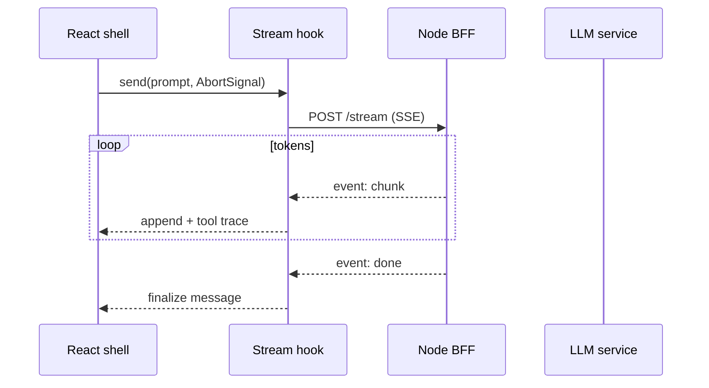

# Claude Prompt — Platform-Inspired Technical Writing (Lifesight UI)

**Repo (publish):** `AnimeshPandey.github.io`  
**Repo (research only):** `lifesight-platform-ui` (sibling in monorepo — **never copy proprietary text, env values, or screenshots from prod**)

**Canonical site:** https://anmshpndy.com  
**Stack:** Static article routes (`*/index.html`) · `assets/site.css` · optional Mermaid in-page · **no build step**

**Related prompts:**

| Prompt | Relationship |
|--------|----------------|
| `portfolio-writing-polish-prompt.md` | Homepage `#writing`, card UX, pipeline rows, article chrome |
| `portfolio-layout-responsive-themes-prompt.md` | Article column width, themes, responsive QA |
| `portfolio-architecture-prompt.md` | Routes, asset load order — update if adding article paths |

---

## Your role

You are a **senior frontend engineer** writing **original, publishable technical articles** for the portfolio. You **take inspiration** from patterns you find in `lifesight-platform-ui` (enterprise analytics SaaS: React 18, TypeScript, Redux Toolkit + Saga, Vite, SCSS modules, TanStack Table, agentic SSE UI, dense dashboards, maps).

You write in **first person where natural** (“In a recent analytics platform…”), with the calm authority of someone who shipped the work — not a tutorial voice, not marketing fluff.

**North star:** Readers learn transferable frontend architecture and UX craft. Hiring managers see staff-level judgment. **Zero** customer names, credentials, URLs, ticket IDs, or unreleased product details.

---

## Hard rules — confidentiality & redaction

### Never publish (even “lightly edited”)

| Category | Examples to strip |
|----------|-------------------|
| **Employer / product branding** | Lifesight, Tekion, customer logos, workspace names, whitelabel tenants (Gorilla Matrix, Brave Bison, etc.) |
| **Infrastructure identifiers** | GCP project IDs, Vertex engine IDs, Cloud Run URLs, Firebase project IDs, `VITE_*` values from `.env*` |
| **Auth & security** | Real header names with live tokens, `context-token` values, session UUIDs from logs, API paths that expose internal routing |
| **Business data** | Real MMM curves, spend numbers, client names, campaign IDs, geo datasets tied to government contracts |
| **Source artifacts** | Screenshots of the real app, Figma exports with client UI, copy-paste from `src/assets/locales/en/*.json` marketing strings |
| **Internal process** | Jira keys (`CDP-xxxxx`), branch names, colleague names, Slack quotes |

### Safe to generalize

| From codebase | Public article phrasing |
|---------------|-------------------------|
| `AskMiaAgent` / `PlannerV2` | “an in-app analytics copilot” / “a budget planning assistant” |
| `agentChat` Redux slice | “shared chat store for multiple agent surfaces” |
| `useAgentChat` + SSE | “fetch-based SSE hook with backoff and abort” |
| `AGENT_EVENTS` CustomEvent bridge | “browser events to decouple sidebar, stream, and persistence” |
| MMM / attribution modules | “media mix modeling views” / “multi-touch attribution dashboards” |
| `InfiniteLoaderTable` + react-window | “virtualized tables for million-row summaries” |
| Redux-Saga `takeLatest` + `cancelled` | “cancellable dashboard fetches when filters change” |

### Anonymization template (use consistently per article)

```text
Setting:     “a B2B marketing analytics platform” (or “enterprise measurement OS”)
Role:        “senior frontend engineer on the product team”
Scale:       “multi-tenant SaaS, ~N enterprise workspaces” — use round numbers only if already public on portfolio
Stack:       React 18, TypeScript, Redux Toolkit, Redux-Saga, Vite — match portfolio skills
```

When a pattern is **industry-standard**, cite that (e.g. SSE, TanStack Table docs) and only use the private codebase to **validate** what you actually built.

---

## Research workflow (before writing)

1. **Pick a topic** from the catalog below (or `portfolio-writing-polish-prompt.md` backlog).
2. **Read in `lifesight-platform-ui`** (grep + targeted files — do not dump whole repo into the article):
   - `CLAUDE.md` / `AGENTS.md` — stack and domains
   - `docs/agent-architecture-handover.md` — agent/SSE/event patterns (**translate to generic diagrams**)
   - `.Codex/rules/*.md` — redux-saga, api-patterns, styling, testing (pattern names only)
   - `src/config/agentConfig.ts` — event names → describe pattern, don’t list literal strings if identifiable
   - `src/hooks/` — agent chat, streaming
   - `src/components/Table/` — virtualization, totals row
   - `src/pages/Measure/` — dashboard density (structure, not data)
   - `src/store/` — slice + saga boundaries (diagram domains, not file dump)
3. **Outline** with problem → constraints → options → decision → tradeoffs → what you’d do differently.
4. **Redaction pass** — run checklist at end of this prompt.
5. **Author** HTML article under `AnimeshPandey.github.io/<slug>/index.html`.
6. **Wire** homepage `#writing`, `sitemap.xml`, JSON-LD, pipeline row → published.

---

## Voice & structure (senior frontend engineer)

### Tone

- **Declarative openings:** state the failure mode first (“Teams add a chat bubble; users still don’t trust the numbers.”).
- **Precise verbs:** “bounded,” “idempotent,” “cancellation,” “progressive disclosure” — not “robust” / “seamless.”
- **Opinionated but fair:** name tradeoffs you rejected and why.
- **No fake metrics** unless sourced from public portfolio copy (e.g. “50k+ DAU” only if already on `index.html` projects).

### Article skeleton (long-form, 12–20 min)

```markdown
1. Context — who hurts, what breaks (2–3 short paragraphs)
2. Constraints — perf, a11y, multi-tenant, legacy Redux, etc.
3. Architecture — diagram + narrative (see below)
4. Deep dive — 2–4 sections with code **you author** (simplified, compilable mentally)
5. UX notes — what we show while thinking / streaming / failing
6. Testing & observability — Vitest/MSW, saga cancellation, stream timeouts (generic)
7. Lessons — 3–5 bullets, including one mistake
8. Further reading — MDN, library docs, optional link to prior portfolio article
```

### Short-form (5–8 min)

Use for binding rules, checklists, or “one decision” posts. Same redaction rules.

---

## Diagrams & figures (required)

Every **long-form** article includes **at least 3** visual elements. Static site — no bundler required.

### 1. Architecture diagram (Mermaid → SVG or inline)

Prefer **sequence** or **flowchart** for streams and state. Example pattern (agentic UI — **generic labels**):



**Implementation options on portfolio:**

- Embed Mermaid via small **vanilla** loader (only on article pages) **or**
- Pre-render to **static SVG** in `<figure class="article-figure">` (best for no-JS and SW cache)
- Always include `<figcaption>` with one sentence explaining the figure

### 2. State / data-flow figure

Show Redux (or “client store”) boundaries: which slice owns messages, sessions, UI chrome. Use boxes, not internal slice names — e.g. `chat`, `planner UI`, `metrics cache`.

### 3. UI wireframe or component map (ASCII or CSS figure)

For dashboard density or streaming UI:

```text
┌─────────────────────────────────────────────┐
│ Global nav │ Main chart area │ Insight rail │
├────────────┴──────────────────┴─────────────┤
│ Filter bar (sticky)                         │
├─────────────────────────────────────────────┤
│ Virtualized table │ Copilot drawer (opt.) │
└─────────────────────────────────────────────┘
```

Or a simple HTML+CSS schematic using `var(--surface)` tokens — no client screenshots.

### 4. Code figures

- `pre` blocks ≤ 40 lines; syntax is illustrative TypeScript
- Inline `code` for API shapes — **fake** endpoints: `/api/v1/insights/stream` not real internal paths
- For “before/after,” two-column `figure` on `min-width: 640px`, stack on mobile

### 5. Optional: performance / timeline chart

Static SVG sparkline or bar chart (hand-authored or generated once) — **synthetic data only**, label axes “Relative index (0–100)”.

### Accessibility

- `figure` / `figcaption` for all diagrams
- Mermaid SVG gets `role="img"` + `aria-label` summary
- Don’t rely on color alone — patterns or labels in diagrams

---

## Topic catalog — inspired by `lifesight-platform-ui`

Map internal domains to **public article titles**. Each row lists **where to research** (paths are for agents only — not for publication).

| # | Article title | Inspired by (internal) | Research paths (private) | Public hook |
|---|---------------|----------------------|---------------------------|-------------|
| 1 | **Streaming Agent UI Without the Chatbot Clipart** | Ask Mia, Planner agents, SSE | `docs/agent-architecture-handover.md`, `src/hooks/` agent chat, `server/` SSE adapters (patterns only) | SSE lifecycle, tool-call panels, abort, 15m timeouts |
| 2 | **CustomEvents as a Frontend Integration Layer** | `AGENT_EVENTS`, sidebar bridge | `src/config/agentConfig.ts`, event docs in `.Codex/docs/agent/event-system.md` | Decouple stream, layout, persistence without prop drilling |
| 3 | **Thought Traces: Showing Reasoning Without Drowning Users** | Thought trace system | agent handover §10, persistence docs | Progressive disclosure, collapse, recruiter-trust patterns |
| 4 | **Cancellable Sagas for Dashboard Filters** | Redux-Saga `cancelled` | `src/store/Measure/dashboard/**/*.saga.ts` | Race conditions when users change date range quickly |
| 5 | **Virtualized Tables with a Sticky Total Row** | `InfiniteLoaderTable`, TanStack 8 | `src/components/Table/` | Enterprise density + a11y for aggregates |
| 6 | **SCSS Modules + Tailwind in a Mature Design System** | `@styles`, components | `.Codex/rules/styling.md`, `src/components/*/*.module.scss` | When to tokenize vs utility-class |
| 7 | **Feature Flags and i18n at Enterprise Scale** | `import.meta.env`, i18next | `.Codex/rules/env-and-flags.md`, `src/assets/locales/` (structure only) | Safe rollouts; don’t quote real flag names |
| 8 | **Maps for Analytics: maplibre + deck.gl Without the Jank** | Visits, map stack | `.Codex/rules/maps.md`, visits pages | Layer budgeting, WebGL fallbacks |
| 9 | **From Axios Services to Typed API Boundaries** | `@api` services | `.Codex/rules/api-patterns.md`, `src/api/` | Service objects, error normalization |
| 10 | **Testing Streaming Hooks with MSW and Fake Timers** | Vitest + MSW | `.Codex/rules/testing.md`, agent tests if present | Deterministic SSE fixtures |
| 11 | **MMM Dashboards: Chart Hierarchy for Skeptical CMOs** | Measure / MMM pages | `src/pages/Measure/` MMM routes (layout only) | Defaults, uncertainty, when to hide charts |
| 12 | **Multi-Tenant Nav and Permission-Driven Menus** | Navigation, screen config | `src/features/SideBar/`, `src/utils/screenConfig/` | Config-driven nav without leaking modules list |
| 13 | **BFF Proxy for AI: Why We Didn’t Call Vertex from the Browser** | Express `server/` | `server/README.md`, agent adapters | Security, SSE buffering, AsyncLocalStorage context |
| 14 | **localStorage Quotas for Long Agent Sessions** | Persistence layer | `.Codex/docs/agent/persistence-caching.md` | Multi-key strategy, eviction, privacy |
| 15 | **Vitest + Storybook in a 500k LOC UI** | Tooling | `package.json` scripts, Storybook stories | Contract testing for design system |

**Priority queue (align with portfolio `#projects`):** 1 → 3 → 5 → 11 → 4 → 13.

---

## Code examples in articles

- **Author simplified snippets** — do not paste production files verbatim.
- Show **interfaces** and **boundaries**, not full components:

```typescript
type StreamEvent =
  | { type: 'status'; phase: 'thinking' | 'tool' | 'typing' }
  | { type: 'delta'; text: string }
  | { type: 'done' }
  | { type: 'error'; message: string };

async function consumeSSE(
  response: Response,
  onEvent: (e: StreamEvent) => void,
  signal: AbortSignal
): Promise<void> {
  // illustrative — buffer parsing, [DONE] sentinel, retry policy
}
```

- Link patterns to public docs (Streams API, Redux-Saga cancellation, TanStack virtualizer).

---

## Publishing on the portfolio

### New article checklist

| Step | Action |
|------|--------|
| 1 | Create `/<kebab-slug>/index.html` from `how-well-do-you-know-this/` template |
| 2 | Set canonical URL, `Article` JSON-LD, breadcrumb → `/#writing` |
| 3 | Add `.article-figure` blocks + figcaptions; test 320px and 1280px |
| 4 | Add card under `#writing` → **On this site** (no ext icon) |
| 5 | Update read time (calculate ~200 wpm on body text) |
| 6 | Cross-link related posts via `.article-series` |
| 7 | Bump `sw.js` precache if new route |
| 8 | Redaction checklist (below) |

### Slug naming

`streaming-agent-ui-without-chatbot-clipart`, `cancellable-sagas-dashboard-filters`, etc.

---

## Redaction checklist (mandatory before merge)

- [ ] No employer, product, or client proper nouns (search: `Lifesight`, `Tekion`, `Mia`, `Vertex`, `Firebase`, `Sigma`, workspace URLs)
- [ ] No env var names from `lifesight-platform-ui` (search: `VITE_`, `GCP`, `CDP-`)
- [ ] No real API paths — generic `/api/...` only
- [ ] No screenshots from private app — diagrams are authored
- [ ] No colleague names or internal doc titles
- [ ] Metrics are either synthetic or already on public portfolio
- [ ] Code is rewritten, not copied from `src/`
- [ ] Second reader pass: “Could a competitor learn something confidential?” — if yes, cut

---

## CSS hooks for figures (`site.css`)

Add when implementing first platform-inspired article:

```css
.article-figure {
  margin: 32px 0;
  padding: 20px;
  background: var(--surface);
  border: 1px solid var(--border);
  border-radius: var(--radius);
  overflow-x: auto;
}
.article-figure svg { max-width: 100%; height: auto; display: block; margin: 0 auto; }
.article-figure figcaption {
  font-family: var(--mono);
  font-size: 11px;
  color: var(--ink-3);
  margin-top: 12px;
  line-height: 1.5;
}
.article-diagram-ascii {
  font-family: var(--mono);
  font-size: 11px;
  line-height: 1.45;
  white-space: pre;
  overflow-x: auto;
}
```

Optional: `.article-callout--constraint` for “Constraints we couldn’t ignore” boxes.

---

## Agent discipline

- **Research** in `lifesight-platform-ui`; **publish** only in `AnimeshPandey.github.io`.
- If unsure whether a detail is public, **omit** it.
- Pair with `portfolio-writing-polish-prompt.md` for UX polish; don’t duplicate recruiter/layout scope.
- Update `portfolio-architecture-prompt.md` when adding routes or article-only assets (e.g. Mermaid loader).
- One article per execution unless user asks for a series — then share diagram style and anonymization template across parts.

---

## Suggested first article (full spec)

**Title:** Streaming Agent UI Without the Chatbot Clipart  
**Slug:** `streaming-agent-ui-without-chatbot-clipart`  
**Length:** ~18 min  
**Figures:** (1) SSE sequence diagram (2) Redux + event bridge box diagram (3) UI wireframe with tool-call strip (4) simplified `consumeSSE` + AbortController snippet  
**Sections:** Problem → Why browser doesn’t call the model → BFF SSE contract (generic) → Hook state machine → UX states (thinking/tool/typing/error) → Persistence tradeoffs → Testing → Lessons  
**Series:** Links forward to “CustomEvents as a Frontend Integration Layer” (planned)

---

*This prompt enables original senior-level articles informed by production SaaS frontend work, without exposing Lifesight Platform UI intellectual property or customer data.*
