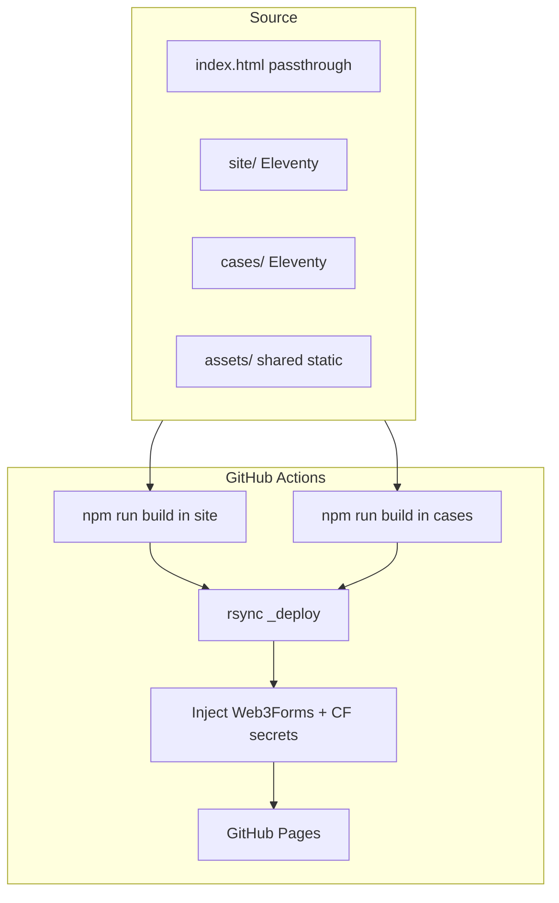

# anmshpndy.com

[](https://anmshpndy.com)
[](https://github.com/AnimeshPandey/AnimeshPandey.github.io/actions/workflows/static-pages.yml)
[](https://www.11ty.dev/)
[](https://anmshpndy.com)

Personal portfolio, technical writing, and **Frontend Casebook** — static site deployed via GitHub Pages.

---

## Live URLs

| Surface | URL |
|---------|-----|
| **Canonical** | https://anmshpndy.com |
| **GitHub Pages origin** | https://animeshpandey.github.io |
| **Casebook** | https://anmshpndy.com/cases/ |
| **Recruiter mode** | https://anmshpndy.com/?recruiter=1 |

---

## Architecture at a glance



**Deploy artifact:** `site/_site/` at repo root paths + `cases/_site/` under `/cases/`. Root `index.html` is copied into `site/_site` before upload (homepage passthrough). Duplicate root article HTML is **not** deployed — articles come from `site/src/*/index.njk` only.

---

## Stack

| Layer | Tech |
|-------|------|
| **Homepage** | Root `index.html` + shared `assets/` |
| **Articles** | Eleventy [`site/`](site/) |
| **Casebook** | Eleventy [`cases/`](cases/) — 31 live cases · 779-article reading library · 167 company pages · Pro tier stubs |
| **Chrome** | `assets/platform/*`, i18n `en` / `hi` / `es`, 6 portfolio themes |
| **SW** | `sw.js` — pass-through (no fetch handler); CI replaces `__AP_BUILD_ID__`; `sw-migrate.js` clears old caches |
| **CI** | [`.github/workflows/static-pages.yml`](.github/workflows/static-pages.yml) |

---

## Key features

| Feature | Entry / notes |
|---------|----------------|
| Section rail + hash nav | `history.pushState` / `replaceState` for `#section` URLs |
| Recruiter briefing | `?recruiter=1`, header toggle; `profile-facts.js` + lazy panel JS |
| Resume modal | PDF iframe preview from `resume.pdf` |
| Theme picker | 6 themes + FOUC guard (`theme.js`, `prefs-chrome.js`) |
| Language picker | `en` / `hi` / `es` (`i18n.js`, partial homepage strings) |
| Casebook Display menu | `display-menu.js` — layout / motion presets per case |
| Device-tier easter eggs | Mobile / tablet / desktop lazy bundles |
| Contact | Web3Forms POST; key injected at deploy |
| Reading library | `/cases/library/` — 779 real-world articles with faceted filters (category, company, year, sort) |
| Company pages | `/cases/companies/` — 167 company index pages auto-generated from library data |
| Pro tier (pre-launch) | 81 Pro badges on hub; honor-system localStorage gate; payments off until 100 MAU |
| Sign-in (beta) | `/account/` — email magic-link flow (copy-link UX; transactional email wiring deferred) |
| Casey companion | Hub/case/library mascot with FSM, hub hero motion, intensity prefs, progression tracking |
| Progression strip | `casebook-companion-v1` localStorage — case progress, confetti milestones, hub strip |
| Service worker | Pass-through (no caching); clears stale `ap-v*` caches via `sw-migrate.js` on deploy |

For file-level detail, LOC notes, and subsystem diagrams see **[docs/ARCHITECTURE.md](docs/ARCHITECTURE.md)**.

---

## Local development

**Full preview (homepage + articles + Casebook):**

```bash
cd site && npm i && npm run build
cd ../cases && npm i && npm run build
mkdir -p site/_site/cases && rsync -a ../cases/_site/ site/_site/cases/
python3 -m http.server 8200
# http://127.0.0.1:8200/ and http://127.0.0.1:8200/cases/
```

**Platform shell check** (header SSOT, stylesheet stack, Eleventy builds):

```bash
./scripts/verify-platform-shell.sh
```

**Homepage-only quick edit** (passthrough root `index.html` + `assets/`):

```bash
npx serve -l 8181 .
```

After changing shared platform assets, bump `CACHE` in `sw.js` to invalidate caches.

---

## Deploy & secrets

Push to `main`. Workflow builds both Eleventy projects, merges into `_deploy`, injects secrets, uploads to GitHub Pages (~1–2 min).

**Repo secrets:** `W3F_ACCESS_KEY` (Web3Forms; alias `WEB3FORMS_ACCESS_KEY`), `CF_BEACON_TOKEN` (Cloudflare; alias `CLOUDFLARE_BEACON_TOKEN`).  
Injected into built HTML / `contact.js` at deploy — never committed.

Repo identity and commit author: **[`.github/REPO_IDENTITY.md`](.github/REPO_IDENTITY.md)**

---

## Maintainer workflows

| Change | Where |
|--------|--------|
| Facts, hero copy, recruiter dates | `index.html` + `assets/profile-facts.js` |
| Platform chrome / themes / i18n | `assets/platform/`, `prefs-chrome.js`, `theme.js`, `i18n.js` |
| Service worker | SW is pass-through — no cache to bump. CI auto-stamps `__AP_BUILD_ID__` on deploy. |
| Platform shell (portfolio + Casebook) | [docs/PLATFORM-SHELL.md](docs/PLATFORM-SHELL.md) · `./scripts/verify-platform-shell.sh` |
| New article | `site/src/<slug>/index.njk` — rebuild `site/` |
| Casebook case | `cases/src/` — rebuild `cases/` |

---

## Documentation

| Path | Purpose |
|------|---------|
| [docs/ARCHITECTURE.md](docs/ARCHITECTURE.md) | Exhaustive technical reference |
| [docs/PLATFORM-SHELL.md](docs/PLATFORM-SHELL.md) | Shared portfolio + Casebook chrome contract |
| [docs/CASEBOOK-ROADMAP.md](docs/CASEBOOK-ROADMAP.md) | Casebook forward roadmap — content polish, Casey smart guide, Pro payments, premium art |
| [docs/README.md](docs/README.md) | Documentation index |
| [.github/REPO_IDENTITY.md](.github/REPO_IDENTITY.md) | Git author + deploy identity |

Planning backlog lives in the private [`ideas`](https://github.com/AnimeshPandey/ideas) repo — see [ideas/IDEAS.md](ideas/IDEAS.md) for the pointer stub.

---

## Contributing

This is a personal site; external PRs are uncommon. If you fork for reference:

1. Do not commit Web3Forms or Cloudflare tokens.
2. Keep factual data in `profile-facts.js` consistent with `index.html`.
3. Run both Eleventy builds before judging article or Casebook paths.

---

## Testing checklist

- [ ] Theme + language pickers; no FOUC; persistence across reload
- [ ] Section rail updates URL hash; back/forward restores section
- [ ] Recruiter: `?recruiter=1` opens panel; facts match `profile-facts.js`
- [ ] Resume modal loads PDF; no layout clip on mobile
- [ ] Casebook `/cases/` builds and Display menu works
- [ ] Contact form: in-page success only (no `mailto:` on submit)
- [ ] Service worker is pass-through; Application tab shows no active cache entries
- [ ] CI deploy green on `main` after doc-only changes
- [ ] `/cases/library/` loads 779 cards; faceted filters work
- [ ] `/cases/companies/` index loads; company detail page renders
- [ ] Hub shows Pro badges on locked cases; unlock CTA renders when payments disabled
