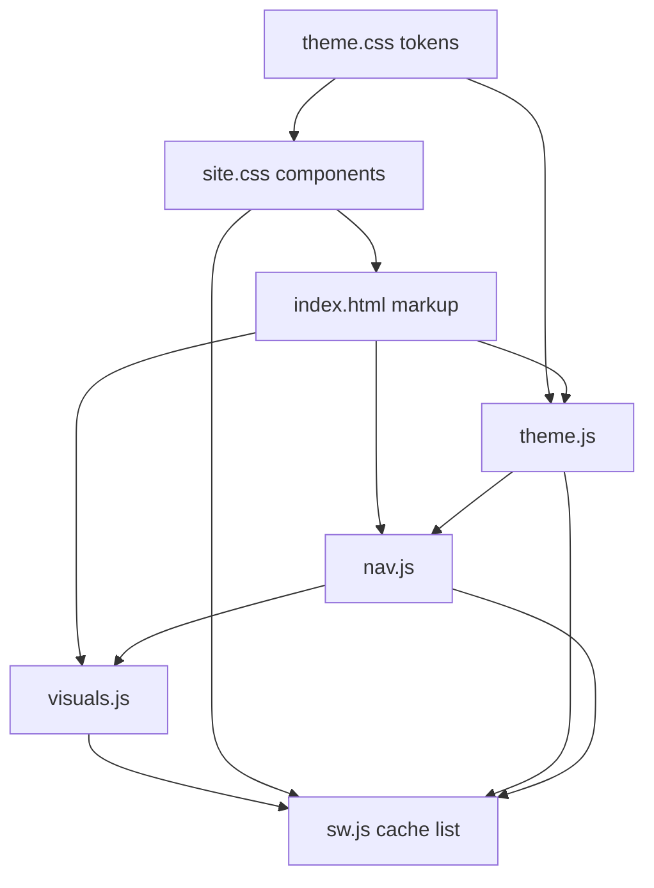

# Claude Prompt — Portfolio Repository Architecture & File Breakdown

**Repo:** `AnimeshPandey.github.io`  
**Canonical site:** https://anmshpndy.com  
**Stack:** Static HTML · CSS custom properties · vanilla JS · GitHub Pages (no build step)

**Use this document when:** refactoring, adding features, onboarding an agent, or reviewing whether a change belongs in the right file. Pair with implementation specs in `docs/portfolio-visuals-implement-prompt.md` and `docs/portfolio-refresh-prompt.md`.

---

## Your role

You are a **staff-level frontend architect** maintaining a **zero-dependency static portfolio**. Before changing code:

1. Map the request to the correct **layer** and **file contract** below.
2. Preserve **progressive enhancement**, **mobile-first CSS**, and **WCAG 2.1 AA**.
3. Prefer extending existing modules over new files unless separation is clear.
4. Never introduce a bundler, framework, or npm dependency without explicit approval.

---

## System overview

```text
┌─────────────────────────────────────────────────────────────────┐
│  GitHub Pages (static-pages.yml) → repo root as artifact        │
│  CNAME: anmshpndy.com                                             │
└────────────────────────────┬────────────────────────────────────┘
                             │
     ┌───────────────────────┼───────────────────────┐
     ▼                       ▼                       ▼
  HTML pages            Shared assets            Discovery / PWA
  (content shells)      (theme + site + JS)      (SEO, SW, manifest)
```

| Concern | Primary artifacts |
|---------|-------------------|
| **Content & semantics** | `index.html`, article `*/index.html`, `404.html` |
| **Design tokens** | `assets/theme.css` |
| **Layout & components** | `assets/site.css` |
| **Core behavior** | `assets/theme.js`, `assets/nav.js` |
| **Optional enhancements** | `assets/visuals.js` (homepage only) |
| **Offline shell** | `sw.js`, `site.webmanifest` |
| **Crawl & identity** | `sitemap.xml`, `robots.txt`, JSON-LD in `<head>` |

---

## Design principles (apply on every change)

### 1. Zero build step

- Ship files that work when uploaded to GitHub Pages.
- No transpilation, no `node_modules`, no import maps unless the project explicitly adopts a pipeline later.
- **Rationale:** deploy = `git push`; predictable diffs; no CI build failures.

### 2. Progressive enhancement

- **HTML** delivers complete content and structure without JS.
- **CSS** delivers readable layout and both themes without JS (except FOUC guard in `<head>`).
- **JS** adds navigation polish, theme toggle persistence, visuals, and form convenience — never required to read copy.

### 3. Mobile-first responsive design

- Base styles target **320px+**; enhance with **`min-width`** breakpoints (`480`, `640`, `820`, `1024`, `1280` in `site.css`).
- Avoid desktop-first layouts “fixed” with `max-width` overrides.
- Touch targets ≥ **44×44px**; form inputs ≥ **16px** font-size on mobile (iOS zoom prevention).

### 4. Separation of concerns (file contracts)

| Layer | Owns | Must not own |
|-------|------|----------------|
| **Tokens** (`theme.css`) | Colors, typography families, spacing tokens, breakpoints as CSS vars, `color-scheme`, `[data-theme]` | Section layout, component rules, animation keyframes for UI |
| **Presentation** (`site.css`) | Reset, components, section layout, breakpoints, article prose, visual/egg styles | Token definitions |
| **Theme behavior** (`theme.js`) | `localStorage.theme`, `dataset.theme`, `meta[name=theme-color]` | Nav, scroll, canvas, forms |
| **Chrome behavior** (`nav.js`) | Mobile menu, focus trap, scroll-spy, progress bar, back-to-top, hero desktop interactions (spotlight, tilt, tagline, stat count-up) | Theme toggle, optional visuals |
| **Enhancements** (`visuals.js`) | Hero canvas, eggs, timeline sync, impact lens, recruiter mode, hire shortcut, theme crossfade hook | Core nav/theme; only load where needed |
| **Page HTML** | Section content, IDs for anchors, JSON-LD, inline FOUC snippet | Large CSS/JS blocks (prefer assets) |

### 5. Accessibility by default

- One `<h1>` per page; landmarks (`header`, `main`, `footer`, labelled `section`s).
- Skip link, visible focus, `aria-*` on custom controls.
- `prefers-reduced-motion: reduce` disables non-essential motion (nav + visuals must respect).
- Decorative canvas/SVG: `aria-hidden="true"`.

### 6. SEO & canonical discipline

- Canonical host: **`https://anmshpndy.com/`** (trailing slash on directory URLs).
- `sitemap.xml`, `robots.txt`, OG/Twitter, and JSON-LD must agree on host.
- Brand domain (`anmshpndy.com`) + discoverable full name (“Animesh Pandey”) in titles and schema.

### 7. Performance-conscious enhancement

- `defer` on all script tags; FOUC theme snippet stays **inline in `<head>`** (only exception).
- Heavy work: lazy via `IntersectionObserver`, `requestAnimationFrame` with pause when off-screen, capability gates in `visuals.js`.
- Service worker: cache static assets; **network-first for HTML** (`sw.js`).
- Bump `CACHE` id in `sw.js` when adding/changing cached assets.

### 8. Minimal scope & no duplication

- Shared chrome (nav, theme, fonts) → link same CSS/JS from every page type.
- Page-specific logic → inline `<script>` at bottom of that page **only** if &lt; ~30 lines and not reused; otherwise extract to a named asset.

---

## Repository map (current)

```text
AnimeshPandey.github.io/
├── index.html                              # Homepage (~1.2k lines): content + JSON-LD + inline page scripts
├── 404.html                                # Custom 404; shared chrome; page-local <style> for layout
├── fundamentals-of-functional-javascript/
│   └── index.html                          # Article: Article JSON-LD, prose body
├── how-well-do-you-know-this/
│   └── index.html                          # Article: Article JSON-LD, prose body
├── assets/
│   ├── theme.css                           # Design tokens (light/dark/system)
│   ├── site.css                            # All components + breakpoints + article + visual styles
│   ├── theme.js                            # Theme toggle + persistence
│   ├── nav.js                              # Nav, scroll UX, hero desktop effects, stat count-up
│   ├── visuals.js                          # Homepage-only enhancements (orchestrator)
│   └── og-image.svg                        # Source/reference; live OG uses og-image.png if present
├── favicon.svg
├── site.webmanifest                        # PWA-lite metadata
├── sw.js                                   # Service worker (cache ap-v*)
├── CNAME                                   # anmshpndy.com
├── robots.txt
├── sitemap.xml
├── resume.pdf                              # Downloadable resume (linked sitewide)
├── animesh_pandey_resume.tex               # LaTeX source (not served)
├── README.md                               # Human ops: local serve, deploy, SEO checklist
├── docs/
│   ├── portfolio-architecture-prompt.md    # This file
│   ├── portfolio-refresh-prompt.md         # Historical/target refresh spec
│   ├── portfolio-visuals-implement-prompt.md
│   └── cross-device-visuals-claude-prompt.md
└── .github/workflows/
    └── static-pages.yml                    # Upload repo root; no Jekyll
```

**Note:** Older specs may reference `visuals.d3.js` / `visuals.three.js`. The **current** desktop easter egg is **Canvas 2D** inside `visuals.js` (no CDN). Do not add D3/Three unless a spec explicitly approves the tradeoff.

---

## Page types & script loading matrix

| Page | Styles | Scripts | `visuals.js` |
|------|--------|---------|--------------|
| `index.html` | `theme.css`, `site.css` | `theme.js`, `nav.js`, `visuals.js` + inline (SW, reveal, form, FAQ) | **Yes** |
| Article `*/index.html` | `theme.css`, `site.css` | `theme.js`, `nav.js` | **No** |
| `404.html` | `theme.css`, `site.css` + inline notfound | `theme.js`, `nav.js` | **No** |

**Rule:** Do not load `visuals.js` on article/404 pages unless those pages gain homepage-only DOM hooks (they should not).

---

## `index.html` — document structure (preserve order)

Logical skeleton for accessibility and SEO:

```text
<html lang="en-IN">
<head>
  ├── charset, viewport (+ viewport-fit=cover)
  ├── FOUC theme inline script (before CSS)
  ├── SEO meta, geo, canonical, rel=me
  ├── OG / Twitter
  ├── fonts (preconnect + stylesheet)
  ├── theme.css → site.css
  └── application/ld+json (@graph: WebSite, Person, FAQPage, …)
<body>
  ├── SVG sprite (icons, aria-hidden)
  ├── skip-link → #main-content
  ├── <header> — logo, desktop nav, theme toggle, resume, hamburger
  ├── #nav-overlay + #mobile-nav
  ├── <main id="main-content">
  │   ├── #hero
  │   ├── #about
  │   ├── #experience — .t-item timeline entries
  │   ├── #skills — .skills-grid (content fallback for any graph)
  │   ├── #projects — .pc cards, data-impact hooks
  │   ├── #writing
  │   ├── #education
  │   └── #contact — #contactForm
  ├── <footer> — recruiter toggle, socials, #yr
  ├── .progress-bar, #back-top
  ├── #shortcut-announce (aria-live for hire shortcut)
  └── scripts (defer): theme.js → nav.js → visuals.js
      └── inline: serviceWorker, scroll reveal, contact mailto, copy email, year, FAQ <style> injection
```

Article pages reuse **header/chrome pattern** but replace `<main>` with `.article-shell` + `.article-prose` only.

---

## CSS architecture

### `assets/theme.css`

- `:root` light tokens; `[data-theme="dark"]`; `@media (prefers-color-scheme: dark)` for unset preference.
- Tokens: `--bg`, `--surface`, `--ink`, `--accent`, `--sage`, `--border`, `--serif`, `--sans`, `--mono`, `--max`, `--nav-h`, `--page-pad`, `--bp-*`, `--theme-color-val`.

### `assets/site.css` (section order)

1. Reset, utilities (`.visually-hidden`), icons, focus, skip link  
2. Nav (desktop + mobile overlay)  
3. Layout (`main`, `section`, typography)  
4. Section components: hero → about → timeline → skills → projects → writing → education → contact → footer  
5. Scroll reveal (`.fade-up`)  
6. **Visuals block** (~line 736+): ticker, skills grid, egg overlays, desktop constellation, recruiter mode, impact lens, timeline `.tl-active`  
7. **Breakpoints** (mobile-first): `≥480`, `≥640`, `≥820`, `≥1024`, `≥1280`  
8. **Article styles** (end of file): breadcrumbs, `.article-prose`, code blocks  

**When adding styles:** put tokens in `theme.css`; put component rules in the matching section of `site.css`; put breakpoint overrides inside the correct `@media (min-width: …)` block.

---

## JavaScript architecture

### Load order (homepage)

```text
1. Inline FOUC (head)     → dataset.theme before paint
2. theme.js (defer)       → read/write localStorage, toggle button
3. nav.js (defer)         → DOMContentLoaded: nav + scroll + hero desktop
4. visuals.js (defer)     → boot: capability gates → init* modules
5. Inline bottom scripts  → page-specific only (see below)
```

### `assets/theme.js`

- `getTheme()` / `applyTheme()` / `#theme-toggle` click.
- Sync `meta[name=theme-color]` with active theme.

### `assets/nav.js` (chrome — all pages that include it)

| Feature | Selector / hook |
|---------|-----------------|
| Mobile menu | `#hamburger`, `#mobile-nav`, `#nav-overlay`, focus trap |
| Scroll-spy | `section[id]`, `.nav-links a`, `aria-current` |
| Sticky header | `header.scrolled` |
| Reading progress | `.progress-bar`, `--pct` |
| Back to top | `#back-top` → focus `#main-content` |
| Hero tagline rotate | `.hero-rotate span` |
| Hero spotlight + 3D tilt + float parallax | `#hero`, `.hero-card`, `.hero-float` — **fine pointer only**, respects reduced motion |
| Stat count-up | `.stat-n` + IntersectionObserver |

### `assets/visuals.js` (homepage only)

| Module | Purpose | Gates |
|--------|---------|--------|
| `initHeroCanvas` | 2D particle field in `#hero` | canvas2d, !reducedMotion, !saveData |
| `initCardExpand` | Project card expand | — |
| `initMobileEgg` | Badge → career snapshot card | coarse / touch-friendly |
| `initDesktopEgg` | `?` → Canvas 2D skills sphere overlay | fine pointer, !reducedMotion |
| `initTimelineHighlight` | `.t-item.tl-active` on scroll | IntersectionObserver |
| `initImpactLens` | Project metric bars | — |
| `initRecruiterMode` | Footer toggle `aria-pressed` | — |
| `initResumeToast` | Feedback on resume download | — |
| `initThemeCrossfade` | `html.theme-transitioning` on theme change | !reducedMotion |
| `initHireShortcut` | `hire` key → `#contact` | keyboard, not in inputs |

**Kill switch:** `window.__VISUALS_DISABLED = true` before `visuals.js` loads.

### Inline scripts on `index.html` (keep or extract deliberately)

| Block | Responsibility | Move to asset if… |
|-------|----------------|-------------------|
| SW register | `navigator.serviceWorker.register('/sw.js')` | Never duplicated |
| Scroll reveal | `.fade-up` + IntersectionObserver | Reused on another page |
| Contact form | mailto + `aria-invalid` validation | Reused |
| Copy email | `#copyEmailBtn` + `#copyToast` | Reused |
| Year | `#yr` textContent | Trivial; can stay |
| FAQ styles | Injected `<style>` for `.faq-*` | **Prefer moving to `site.css`** on next touch |

**Conflict rule:** `nav.js` owns hero **mouse** spotlight/tilt; `visuals.js` owns hero **canvas** particles. Do not duplicate `mousemove` handlers on `#hero` without coordinating both.

---

## SEO, hosting & offline

| File | Contract |
|------|----------|
| `sitemap.xml` | Only canonical `anmshpndy.com` URLs; update `lastmod` on meaningful content changes |
| `robots.txt` | `Allow: /` + sitemap URL |
| `CNAME` | Must match GitHub Pages custom domain |
| `site.webmanifest` | `name`, `icons`, `theme_color` — keep aligned with light theme default |
| `sw.js` | `CACHE` version string; `ASSETS` list must include new static JS/CSS; HTML network-first |
| JSON-LD | Per-page `@graph` in `<head>`; do not strip `Person` / `WebSite` / `FAQPage` on homepage without replacement |

---

## Dependency graph (safe change order)



---

## Extension guidelines — where to put new work

| You want to add… | Put it in… |
|------------------|------------|
| New color or spacing token | `theme.css` |
| New section layout or component | `site.css` + markup in relevant `.html` |
| Theme-related behavior | `theme.js` |
| Nav, scroll, header, back-to-top | `nav.js` |
| Homepage-only animation or egg | `visuals.js` + styles under VISUALS section in `site.css` |
| New article | `slug/index.html` + row in `sitemap.xml` |
| New cached asset | file in `assets/` + bump `sw.js` `CACHE` |
| Structured data | `<script type="application/ld+json">` in that page's `<head>` |
| Site-wide copy change | `index.html` (and articles if mirrored) |

### Adding a new optional JS module

Only if the module is **large** or **lazy-loaded**:

```text
assets/visuals.feature.js   → loaded dynamically from visuals.js
```

Keep the orchestrator in `visuals.js`; avoid a fourth always-on script on homepage.

---

## Anti-patterns (reject in review)

- Putting layout rules in `theme.css` or tokens in `site.css`
- Loading `visuals.js` on article pages
- Adding React/Vue/Svelte or a bundler without explicit approval
- Hover-only interactions with no keyboard path
- CDN scripts blocking first paint for decorative effects
- Duplicating FOUC logic outside the single inline `<head>` snippet
- Forgetting to bump `sw.js` cache after asset changes
- `animeshpandey.github.io` URLs in canonical/sitemap while marketing `anmshpndy.com`
- Inline styles for large new components (use `site.css` unless 404-style isolated page)

---

## Verification checklist (architecture-level)

After structural changes, confirm:

- [ ] All page types still link `theme.css` + `site.css`
- [ ] FOUC snippet present in `<head>` before CSS on every themed page
- [ ] Homepage script order: `theme.js` → `nav.js` → `visuals.js`
- [ ] Article/404 do **not** load `visuals.js`
- [ ] `sw.js` `ASSETS` matches deployed static files
- [ ] No horizontal scroll at 320px on homepage
- [ ] Reduced motion disables canvas, ticker animation, count-up, crossfade
- [ ] One H1 per page; skip link targets `#main-content`

---

## Related documentation

| Document | Use for |
|----------|---------|
| `docs/portfolio-architecture-prompt.md` | **This file** — where code lives and why |
| `docs/portfolio-visuals-implement-prompt.md` | Shipping/visual tier implementation |
| `docs/cross-device-visuals-claude-prompt.md` | Visual quality bar, device matrix, a11y rules |
| `docs/portfolio-refresh-prompt.md` | Original refresh tasks (historical; many are done) |
| `README.md` | Local serve, deploy, human checklist |

---

## Execution instruction for Claude

When asked to implement a feature:

1. **Classify** the request against layers and the script matrix above.  
2. **Propose** file touch list (minimal).  
3. **Implement** following mobile-first CSS and progressive enhancement.  
4. **Update** `sw.js` cache id if assets changed.  
5. **Report** what you changed per file and any intentional deferrals.

Do not refactor unrelated files. Do not add dependencies. Preserve canonical SEO and existing JSON-LD unless the task explicitly updates schema.
