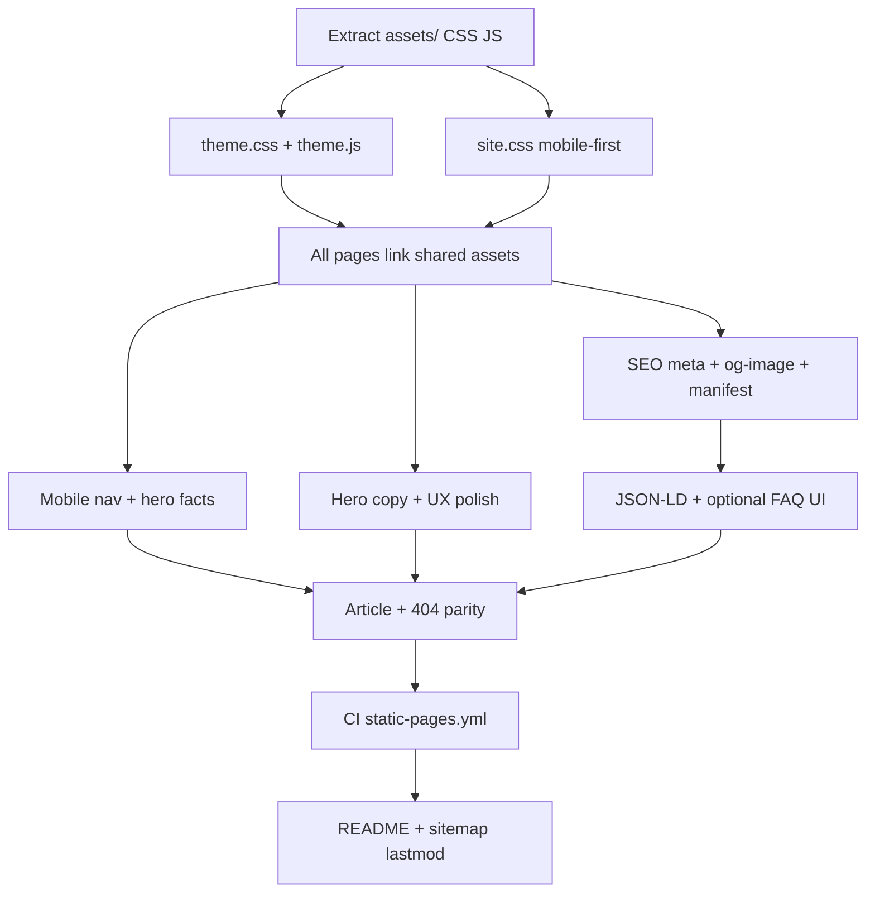

# Portfolio refresh — SEO, mobile-first UX, theming, memorable hero

**Repo:** `AnimeshPandey.github.io`  
**Live:** https://anmshpndy.com (CNAME) · https://animeshpandey.github.io (GitHub Pages)  
**Stack:** Pure HTML / CSS / vanilla JS — **no build step** (keep it that way unless you add a trivial asset pipeline)

---

## Context pack

| Item | Value |
|------|--------|
| Primary file | `index.html` (~1,600 lines — HTML + inline CSS + JS) |
| Article pages | `fundamentals-of-functional-javascript/index.html`, `how-well-do-you-know-this/index.html` |
| SEO assets | `sitemap.xml`, `robots.txt`, `CNAME` → `anmshpndy.com` |
| 404 | `404.html` |
| CI | `.github/workflows/jekyll-gh-pages.yml` (Jekyll — **mismatch** for static HTML) |
| Fonts | DM Serif Display, Plus Jakarta Sans, JetBrains Mono (Google Fonts) |
| Design | Warm editorial — cream `#FAF8F4`, ink `#1C1714`, terracotta accent `#BF5A32`, sage `#4E7A68` |
| Resume | `resume.pdf` linked throughout — ensure file exists in repo root |
| Done when | Mobile-first layout verified at 320–428px; Lighthouse SEO ≥95, A11y ≥95 (mobile emulation); dark/light toggle everywhere; hero copy distinctive; touch targets ≥44px; no horizontal scroll; social previews have images; zero build step |

---

## Repository architecture

Logical breakdown of the repo **today** vs **target** after this refresh. No bundler — the “architecture” is how HTML shells, shared assets, SEO files, and deploy config divide responsibility.

### Current layout (as-is)

```
AnimeshPandey.github.io/
├── index.html                          # MONOLITH: markup + ~800 lines CSS + JS
├── 404.html                            # Standalone; duplicated tokens/styles
├── fundamentals-of-functional-javascript/
│   └── index.html                      # Article shell; own <style> block
├── how-well-do-you-know-this/
│   └── index.html                      # Article shell; own <style> block
├── favicon.svg                         # Brand mark (SVG)
├── CNAME                               # Custom domain → anmshpndy.com
├── robots.txt                          # Crawler rules + sitemap URL
├── sitemap.xml                         # URL list (homepage + 2 articles)
├── resume.pdf                          # Binary (linked; verify exists)
├── animesh_pandey_resume.tex           # Source for resume (not served)
├── README.md                           # Deploy/setup notes
├── docs/
│   └── portfolio-refresh-prompt.md     # Implementation spec (this file)
└── .github/workflows/
    └── jekyll-gh-pages.yml             # Jekyll deploy (mismatch for static HTML)
```

### Target layout (after refresh)

```
AnimeshPandey.github.io/
├── index.html                          # Page shell: sections, JSON-LD, asset links
├── 404.html                            # Error page; same chrome as site
├── fundamentals-of-functional-javascript/
│   └── index.html                      # Article content + shared head/chrome
├── how-well-do-you-know-this/
│   └── index.html                      # Article content + shared head/chrome
├── assets/
│   ├── site.css                        # Mobile-first layout + components
│   ├── theme.css                       # :root tokens, [data-theme] light/dark
│   ├── theme.js                        # Theme toggle, FOUC guard, theme-color meta
│   ├── nav.js                          # (optional) Mobile menu + scroll-spy
│   └── og-image.png                    # 1200×630 social preview
├── favicon.svg
├── site.webmanifest                    # PWA-lite manifest (name, theme_color, icons)
├── CNAME
├── robots.txt
├── sitemap.xml
├── resume.pdf
├── animesh_pandey_resume.tex
├── README.md
├── docs/
│   └── portfolio-refresh-prompt.md
└── .github/workflows/
    └── static-pages.yml                # Static upload (no Jekyll)
```

### Layer model

| Layer | Responsibility | Files |
|-------|----------------|--------|
| **Pages (presentation)** | Semantic HTML, section content, one `<h1>` per page | `index.html`, `404.html`, `*/index.html` (articles) |
| **Styles — tokens** | Colors, type scales, spacing, breakpoints, `color-scheme` | `assets/theme.css` |
| **Styles — components** | Nav, hero, timeline, cards, form, footer, utilities | `assets/site.css` |
| **Behavior** | Theme persistence, mobile nav, form mailto, scroll-spy, optional share/copy | `assets/theme.js`, `assets/nav.js` (or inline in `index.html` until split) |
| **SEO & discovery** | Meta, OG/Twitter, canonical, JSON-LD | `<head>` per page + `sitemap.xml` + `robots.txt` |
| **Brand & install** | Favicon, manifest, OG image | `favicon.svg`, `site.webmanifest`, `assets/og-image.png` |
| **Hosting** | Domain + GitHub Pages deploy | `CNAME`, `.github/workflows/static-pages.yml` |
| **Content assets** | Downloadable resume, LaTeX source | `resume.pdf`, `animesh_pandey_resume.tex` |
| **Docs** | Agent/human implementation guide | `docs/portfolio-refresh-prompt.md`, `README.md` |

### `index.html` internal structure (logical sections)

Even after CSS/JS extraction, keep this **document order** for a11y and SEO:

```
index.html
├── <head>
│   ├── charset, viewport (+ viewport-fit)
│   ├── FOUC theme snippet (inline, before CSS)
│   ├── SEO meta + OG/Twitter + canonical
│   ├── font preconnect + stylesheet links
│   ├── theme.css → site.css
│   └── application/ld+json (@graph: WebSite, Person, FAQPage?, Articles)
├── <body>
│   ├── SVG sprite (icons, aria-hidden)
│   ├── skip-link
│   ├── <header> — logo, desktop nav, theme toggle, resume, hamburger
│   ├── mobile-nav overlay/sheet (#mobile-nav)
│   ├── <main>
│   │   ├── #hero — badge, h1, subhead, tag, CTAs, hero-card | hero-facts
│   │   ├── #about — copy, stats, optional FAQ accordion
│   │   ├── #experience — timeline
│   │   ├── #skills — category rows
│   │   ├── #projects — card grid
│   │   ├── #writing — articles, profile chips, drafts
│   │   ├── #education — edu card
│   │   └── #contact — quick actions, form
│   ├── <footer> — socials, copyright
│   └── scripts: theme.js, nav.js (defer)
```

Article pages reuse **head chrome** (fonts, CSS, theme, nav) + **article body** (prose, breadcrumbs markup) + **Article** JSON-LD only.

### Dependency graph (what must land before what)



### Per-file contract (single source of truth)

| File | Owns | Must not own |
|------|------|----------------|
| `assets/theme.css` | CSS variables, `[data-theme]`, `color-scheme`, breakpoint tokens | Component layout, section-specific rules |
| `assets/site.css` | Layout, components, `@media` progression, print styles | Theme token definitions |
| `assets/theme.js` | `localStorage.theme`, `dataset.theme`, `<meta theme-color>` update | Nav open/close (unless kept together for tiny site) |
| `assets/nav.js` | Hamburger, focus trap, `aria-expanded`, scroll-spy | Theme logic |
| `index.html` | Homepage content, homepage JSON-LD graph | Duplicated CSS/JS blocks post-refactor |
| Article `index.html` | Article body, Article schema, breadcrumbs schema | Copy of full homepage sections |
| `404.html` | Error copy, quick links | Business content |
| `sitemap.xml` | Canonical URLs only | Styling |
| `site.webmanifest` | `name`, `icons`, `theme_color` | HTML |

---

## Claude implementation prompt

You are a **Senior Frontend Engineer + technical SEO specialist** working on a **personal portfolio** hosted on GitHub Pages. The site is a single-file static experience with strong existing foundations (structured data, FAQ schema, skip link, reduced-motion hooks). Your job is to **elevate SEO, mobile-first responsive UX, theming, and memorability** without turning this into a framework app.

**Design approach:** Mobile-first — base CSS targets small viewports (320px+); progressive enhancement via `min-width` media queries. Do not rely solely on `max-width` overrides to “fix” desktop layouts bolted onto mobile as an afterthought.

### Non-negotiables

1. **Keep zero build step** — deliver working HTML/CSS/JS that deploys by push to `main`.
2. **Preserve custom domain** canonical URLs: `https://anmshpndy.com/` (trailing slash policy: pick one and use consistently in `canonical`, `sitemap.xml`, and internal links).
3. **Do not remove** existing JSON-LD (`Person`, `WebSite`, `FAQPage`, `Article` entries) — extend/fix, don’t gut.
4. **Accessibility first** — WCAG 2.1 AA: contrast in both themes, keyboard nav, visible focus, `aria-*` on theme toggle and mobile menu; touch targets ≥44×44px.
5. **Mobile-first responsive** — no horizontal page scroll at 320px; readable typography; all primary actions reachable without hover.
6. **Minimize scope** — no blog CMS, no React rewrite, no new dependencies unless justified (e.g. one small shared `theme.js` is OK).

---

## Current state audit (read before coding)

### What’s already strong

- Rich `<head>` SEO: title, description, geo, `rel=me`, Open Graph profile type, Twitter cards, FAQ + Person schema.
- Semantic sections, `aria-labelledby`, skip link, print stylesheet, `prefers-reduced-motion` guard.
- Distinctive visual identity (serif + mono labels, terracotta accent, hero info card).
- Article subpages with Article schema and OG `article` type.
- `sitemap.xml` + `robots.txt` pointing at custom domain.

### Gaps to fix (prioritized)

| Area | Issue | Impact |
|------|--------|--------|
| **SEO** | No `og:image` / `twitter:image` on any page | Weak link previews; missed rich-result signals |
| **SEO** | `twitter:card` = `summary` only | Use `summary_large_image` once OG image exists |
| **SEO** | `theme-color` fixed to `#1C1714` while UI is light | Browser chrome mismatch; update per theme |
| **SEO** | Article canonicals omit trailing slash; homepage uses `/` | Consolidate to avoid duplicate URL signals |
| **SEO** | No `link rel="alternate" type="application/rss+xml"` (optional) | Low priority unless you add a feed |
| **Perf** | Google Fonts block render; no `font-display: swap` in URL | Add `&display=swap`; consider self-hosting later |
| **Perf** | ~800 lines inline CSS duplicated on 404/articles | Extract shared `assets/site.css` + `assets/theme.css` (still no bundler) |
| **UX** | **No mobile nav** — `.nav-links { display: none }` below 640px with no hamburger | Critical — users can’t reach sections on phone |
| **UX** | `cursor: none` + custom cursor | Hurts usability; many users hate it — default cursor, optional subtle hover only on desktop |
| **Responsive** | Layout authored desktop-first (`max-width: 640px` patches only) | Harder to maintain; easy to miss breakpoints — invert to mobile-first `min-width` |
| **Responsive** | Hero `100vh` + floating keywords + two-column grid | Overflow/clipping on small screens; decorative floats should hide or shrink on narrow viewports |
| **Responsive** | `--max: 820px` with fixed `28px` padding | OK on tablet; verify `padding` uses `clamp()` for 16px on phones |
| **Responsive** | Stats / projects / skills grids | Partially adapted — audit all grids for single-column default |
| **Responsive** | Article pages + `404` | May lack same nav/theme/mobile patterns as homepage |
| **Mobile** | No `viewport-fit=cover` / safe-area env() | Notch/home-indicator overlap on iOS |
| **Mobile** | Form inputs likely `<16px` effective | iOS Safari zooms on focus — use `font-size: 16px` minimum on inputs |
| **Mobile** | Touch: `cursor: none`, hover-only affordances | Use `:hover` enhancements only inside `@media (hover: hover)` |
| **UX** | Hero `.hero-card` hidden on mobile | Loses status/stack/availability — surface key facts another way |
| **UX** | Contact form is mailto-only | OK for v1; improve success copy and validation messages |
| **CI** | Jekyll workflow for non-Jekyll site | Replace with static Pages deploy or document “Deploy from branch / root” only |
| **Content** | Hero tagline is competent but generic | See hero section below |
| **Theming** | Light only | Add dark mode + system preference + manual toggle |

---

## Task 1 — Shared design tokens & dark/light theming

### 1.1 CSS variable architecture

Refactor `:root` in `index.html` (and mirror on article pages + `404.html`) to:

```css
:root {
  color-scheme: light;
  /* semantic tokens */
  --bg: ...;
  --surface: ...;
  --ink: ...;
  --accent: ...;
  /* ... */
}

[data-theme="dark"] {
  color-scheme: dark;
  /* full dark palette — not just inverted filters */
}

@media (prefers-color-scheme: dark) {
  :root:not([data-theme="light"]) { /* dark tokens */ }
}
```

**Dark palette guidance** (tune for contrast ≥4.5:1 body text):

- Background: deep warm charcoal (~`#141210`), not pure `#000`
- Surfaces: stepped elevations (`#1C1916`, `#252220`)
- Ink: warm off-white (`#F5F0E8`)
- Accent: slightly brighter terracotta (~`#E07A52`) for buttons/links
- Sage: desaturate for dark (`#7BAF98` on `#1a2e26`)
- Hero dot-grid and glows: reduce opacity; avoid muddy multiply on dark

### 1.2 Theme toggle UI

- Add a **theme toggle** in `header` (nav-right, before Resume): sun/moon icon button.
- Behavior:
  1. On load: read `localStorage.theme` (`light` | `dark` | unset).
  2. If unset, respect `prefers-color-scheme`.
  3. On click: toggle and persist.
  4. Set `document.documentElement.dataset.theme` (or `class`).
- Accessibility: `aria-label="Switch to dark mode"`, `aria-pressed`, focus ring, **no** `cursor: none` on the control.
- Update `<meta name="theme-color">` dynamically (small inline script in `<head>` or early body).

### 1.3 Shared assets (recommended)

Create:

```
assets/
  site.css      /* layout, components — imported by all pages */
  theme.css     /* tokens + [data-theme] */
  theme.js      /* toggle + meta theme-color + FOUC prevention snippet */
```

**FOUC prevention:** Inline in `<head>` before CSS:

```html
<script>
(function () {
  var t = localStorage.theme;
  var d = t === 'dark' || (!t && matchMedia('(prefers-color-scheme: dark)').matches);
  if (d) document.documentElement.dataset.theme = 'dark';
})();
</script>
```

Article pages and `404.html` must use the **same** tokens and toggle.

---

## Task 2 — SEO hardening

### 2.1 Social preview image

- Add `assets/og-image.png` (or `.jpg`) — **1200×630**, safe zone center.
- Content suggestion: name, title “Senior Frontend Engineer”, subtle stack chips, brand colors — readable at thumbnail size.
- On **every** HTML page:

```html
<meta property="og:image" content="https://anmshpndy.com/assets/og-image.png" />
<meta property="og:image:width" content="1200" />
<meta property="og:image:height" content="630" />
<meta property="og:image:alt" content="Animesh Pandey — Senior Frontend Engineer, Bangalore" />
<meta name="twitter:card" content="summary_large_image" />
<meta name="twitter:image" content="https://anmshpndy.com/assets/og-image.png" />
```

- Add `og:image` to JSON-LD `Person` / `WebSite` if appropriate (`image` property).

### 2.2 Meta polish

- **Title pattern:** `Animesh Pandey — Senior Frontend Engineer | React, TypeScript, Next.js` (≤60 chars).
- **Description:** Lead with outcome + location + hire status; include primary keywords naturally (no stuffing).
- Add `<link rel="manifest" href="/site.webmanifest">` with `name`, `short_name`, `theme_color`, `background_color`, icons (reuse `favicon.svg` + optional 192 PNG).
- Add `<link rel="sitemap" type="application/xml" href="/sitemap.xml">` in `<head>`.
- Ensure **one** canonical style (prefer trailing slash for directories).

### 2.3 Structured data updates

- Add `image` to `Person` schema → OG image URL.
- Add `BreadcrumbList` on article pages: Home → Writing → Article.
- Consider `ProfilePage` type linking to `#person` (optional, validate in Rich Results Test).
- Keep `FAQPage` — ensure on-page FAQ section exists OR remove schema (Google prefers visible FAQ content). **Either add a compact FAQ accordion in `#about` or footer, or remove FAQ schema.**

### 2.4 Technical SEO files

- Update `sitemap.xml` `<lastmod>` for homepage when deploying.
- `robots.txt`: keep as-is; confirm no accidental `Disallow`.
- Add **humans.txt** or skip (optional).

### 2.5 Performance signals (SEO-adjacent)

- `font-display: swap` on Google Fonts URL.
- `loading="lazy"` on any below-fold images you add.
- Preconnect only to `fonts.googleapis.com` / `fonts.gstatic.com` (already present).
- Target Lighthouse: Performance ≥90, SEO 100, Accessibility ≥95.

### 2.6 Brand domain (`anmshpndy.com`) vs name search (“Animesh Pandey”)

**Reality check:** Google does **not** require the domain to match your legal name. Your `title`, `H1`, `Person` schema, and FAQ already say “Animesh Pandey” — that is the main on-page signal. A short handle domain (`anmshpndy`) mainly affects:

- **Exact-name queries** (“Animesh Pandey portfolio”) — slightly weaker URL relevance than `animeshpandey.com` / `animeshpandey.dev`.
- **Entity consolidation** — if recruiters see `anmshpndy.com`, `animeshpandey.github.io`, and `github.com/AnimeshPandey` without redirects, authority is split.
- **Resume / PDF consistency** — `animesh_pandey_resume.tex` still points at `animeshpandey.github.io`; align to one canonical URL.

**Recommended strategy: keep `anmshpndy.com` as canonical brand URL** (matches @anmshpndy handles) and **strengthen name discovery** around it — don’t replace the domain unless you acquire a name-based domain for redirect.

#### A. Consolidate to one canonical host (high impact)

Pick **`https://anmshpndy.com/`** as canonical (already in `CNAME`, `sitemap`, JSON-LD).

| URL | Action |
|-----|--------|
| `https://animeshpandey.github.io/*` | **301 redirect** to `https://anmshpndy.com/*` (GitHub Pages: add redirect file or enforce via meta refresh only as last resort — prefer server/host redirect) |
| `http://anmshpndy.com` | Force HTTPS (GitHub Pages does this when Enforce HTTPS is on) |
| `www.anmshpndy.com` | 301 to apex or vice versa — pick one; register in Search Console |

Add both properties in **Google Search Console** during migration; submit `sitemap.xml` only on the canonical host.

#### B. Schema: explicit name + handle (no code change to domain)

Extend `Person` in `index.html`:

```json
{
  "@type": "Person",
  "name": "Animesh Pandey",
  "givenName": "Animesh",
  "familyName": "Pandey",
  "alternateName": ["anmshpndy", "Animesh Pandey"],
  "url": "https://anmshpndy.com/",
  "identifier": [
    { "@type": "PropertyValue", "propertyID": "GitHub", "value": "AnimeshPandey" },
    { "@type": "PropertyValue", "propertyID": "X", "value": "anmshpndy" }
  ],
  "sameAs": [
    "https://linkedin.com/in/pandeyanimesh",
    "https://github.com/AnimeshPandey",
    "https://animeshpandey.github.io",
    "https://x.com/anmshpndy"
  ]
}
```

Add `WebSite` with `"name": "Animesh Pandey"` and optional `"alternateName": "anmshpndy"`. Use `@type": "ProfilePage"` on homepage linking `"mainEntity": { "@id": "#person" }` if Rich Results Test validates it.

#### C. Visible copy — brand without hiding the name

| Location | Recommendation |
|----------|----------------|
| **`<title>`** | Always start with **Animesh Pandey** (already correct) |
| **H1** | Full name (already correct) |
| **Nav logo** | `AP.` is fine visually; keep `aria-label="Animesh Pandey — home"` |
| **Hero subhead** | Include role + optional handle: `Senior Frontend Engineer · anmshpndy.com` only if subtle — prefer role + stack in subhead, handle in footer |
| **Footer** | `Animesh Pandey` first, domain second: `Animesh Pandey · Bangalore · anmshpndy.com` |
| **Article footers** | Change `← anmshpndy.com` to `← Animesh Pandey` or `← Home` with `aria-label` — domain alone does not help name rankings |
| **OG image** | Large readable **“Animesh Pandey”** text; small `anmshpndy.com` in corner optional |

#### D. Optional: name-based domain as redirect (best long-term for “Animesh Pandey” SERP)

If available and affordable, register one of:

- `animeshpandey.com` / `animeshpandey.dev` / `animeshpandey.in`

Point **301 → `https://anmshpndy.com/`** (do not run two live sites with duplicate content). Benefits:

- Typo/traffic capture for people who guess your full name
- Stronger association in human + crawler memory
- Resume can show **both**: `animeshpandey.com` (redirects) or primary `anmshpndy.com` only

#### E. Off-site consistency (often beats domain wording)

| Surface | Use |
|---------|-----|
| LinkedIn headline | “Animesh Pandey” + role; **Featured** link → `https://anmshpndy.com/` |
| GitHub profile | Display name “Animesh Pandey”; Website → `https://anmshpndy.com/` |
| GitHub repo `AnimeshPandey.github.io` | README + About URL → custom domain |
| HackerNoon / Medium / Dev.to bios | Same URL; author name “Animesh Pandey” |
| Resume PDF | Single line: `anmshpndy.com` with label **Portfolio** or spell out `Animesh Pandey — anmshpndy.com` |

#### F. Content that ranks for name + intent

FAQ schema is good — add visible FAQ with questions literally containing **“Animesh Pandey”** (already in JSON-LD). Add one short **“About this site”** line in footer or about:

> *Personal site of **Animesh Pandey**, Senior Frontend Engineer (also @anmshpndy).*

Publish 1–2 new posts (2025–2026) with byline “Animesh Pandey” linking home — stale 2021 articles still help, but fresh `dateModified` on homepage helps crawl priority.

#### G. What **not** to do

- Don’t stuff “Animesh Pandey” into the domain in body copy unnaturally.
- Don’t run `anmshpndy.com` and `animeshpandey.github.io` as duplicate indexes without redirect.
- Don’t change `og:site_name` to `anmshpndy` — keep **Animesh Pandey**.
- Don’t drop `anmshpndy.com` from `sameAs` — it reinforces your X/Medium brand; pair it with full name everywhere else.

#### H. Commit hook for this work

`portfolio: strengthen Person schema and name-first copy for brand domain` — Task 2.6 + resume/README URL alignment (see commit table).

---

## Task 3 — Mobile-first & responsive design

Treat **phones as the default canvas**, then enhance for tablet and desktop. Most portfolio traffic is mobile — optimize for thumb reach, scanability, and fast first paint.

### 3.1 Breakpoint system

Define tokens and use consistently (rename/refactor existing `640px` magic number):

```css
:root {
  --bp-sm:  480px;   /* large phones */
  --bp-md:  640px;   /* phablet / small tablet */
  --bp-lg:  820px;   /* content max-width — matches --max */
  --bp-xl: 1024px;   /* comfortable desktop enhancements */
  --page-pad: clamp(16px, 4vw, 28px);
  --nav-h: 56px;     /* slightly shorter on mobile OK */
}
```

**Authoring order:**

1. Base rules: single column, full-width CTAs, stacked hero, hidden decorative floats.
2. `@media (min-width: 480px)` — optional two-column stats if space allows.
3. `@media (min-width: 640px)` — projects grid 2-col; skills row layout.
4. `@media (min-width: 820px)` — hero two-column + hero-card visible; desktop nav inline.
5. `@media (min-width: 1024px)` — optional max typography scale cap.

Use **`min-width` only** for layout progression. Reserve `max-width` for rare exceptions (e.g. print, reduced nav on very small only if needed).

### 3.2 Viewport & safe areas

In `<head>` on all pages:

```html
<meta name="viewport" content="width=device-width, initial-scale=1, viewport-fit=cover" />
```

Apply safe-area padding where fixed UI touches screen edges:

```css
header {
  padding-left: max(var(--page-pad), env(safe-area-inset-left));
  padding-right: max(var(--page-pad), env(safe-area-inset-right));
}
/* mobile nav sheet, footer, optional sticky bar */
```

### 3.3 Typography & readability (mobile)

- **Body:** `font-size: clamp(15px, 2.5vw, 16.5px)`; `line-height: 1.65–1.75`.
- **H1 (hero name):** keep `clamp()` but cap max size so long names don’t overflow on 320px (test “Animesh Pandey” + line break).
- **Line length:** prose blocks `max-width: 65ch` on all viewports.
- **Prevent overflow:** `overflow-wrap: anywhere` on emails/URLs; `word-break: normal` on headings.
- **Floating hero keywords** (`.hero-float`): `display: none` by default; show only `@media (min-width: 820px) and (prefers-reduced-motion: no-preference)` at low opacity.

### 3.4 Touch & pointer targets

| Element | Minimum size | Notes |
|---------|----------------|-------|
| Nav links (mobile menu) | 44×44px hit area | Full-row tappable rows, not tiny text |
| Hamburger / theme toggle / Resume | 44×44px | Adequate spacing (`gap` ≥ 8px) |
| CTAs (`.btn`, `.cq-btn`, `.form-btn`) | 44px height, full-width on `<640px` | Stack vertically with `gap: 12px` |
| Footer social chips | 44px touch height | Wrap cleanly |
| Skill tags (`.sk`) | Decorative on desktop; don’t rely on tap | No critical actions on hover-only tags |

- Wrap interactive enhancements:

```css
@media (hover: hover) and (pointer: fine) {
  .pc:hover { /* lift, border */ }
}
```

- Disable custom cursor on touch/coarse pointers (already partially done — enforce globally).

### 3.5 Layout patterns by section

| Section | Mobile (default) | ≥640px | ≥820px |
|---------|------------------|--------|--------|
| **Hero** | Single column; min-height `auto` or `min(100svh, …)` — avoid trapping content below fold | — | Grid 1fr + 270px card; show `.hero-card` |
| **Hero CTAs** | `flex-direction: column`; buttons `width: 100%` | Row wrap | Inline row |
| **Hero facts** | `.hero-facts` strip (chips + status) when card hidden | — | Card OR strip, not both |
| **Stats** | 2×2 grid or vertical stack | 4-column row | Same |
| **Timeline** | Reduce `padding-left`; ensure dot doesn’t clip | — | Current layout |
| **Skills** | Category stacks above tags (`grid-template-columns: 1fr`) | Side-by-side label + tags | Same |
| **Projects** | 1 column | 2 columns | 2 columns; `.pc.wide` spans full |
| **Articles** | Full-width cards; meta wraps | — | — |
| **Contact** | Single column form; quick actions stack | 2-col name/email | Same |
| **Footer** | Center or stack socials | Row space-between | Same |

**No horizontal scroll:** Run DevTools at 320×568 and 390×844; fix any `100vw`/`overflow` from hero or negative margins.

### 3.6 Mobile navigation (required)

Default (mobile): **hamburger** visible; desktop inline `.nav-links` hidden until `min-width: 820px` (or 768px if you prefer earlier reveal).

- `button` hamburger: `aria-expanded`, `aria-controls="mobile-nav"`, `aria-label="Open menu"`.
- Panel: full-viewport overlay or slide-from-right sheet; includes **all** section anchors, **Resume**, **theme toggle**, optional **Email** shortcut.
- **Focus trap** when open; close on Escape, overlay tap, and nav link click.
- `document.body.style.overflow = 'hidden'` while open (restore on close).
- Optional: add `position: sticky` header with subtle `box-shadow` on scroll (`scrollY > 8`) — keep performant (`passive` listener).

### 3.7 Mobile-first features (high value)

Implement a subset that fits the static stack:

1. **Sticky mobile action bar** (optional, `≤819px`): slim bar above footer or below header with “Resume” + “Contact” — doesn’t block content (`padding-bottom` on `body` if fixed).
2. **Tap-to-contact:** `mailto:` and `tel:` links styled as prominent chips in hero fact strip and contact section.
3. **Copy email** button next to email chip — `navigator.clipboard.writeText` with toast/`role="status"` fallback.
4. **Horizontal scroll chips** (stack tags, profile chips): `display: flex; overflow-x: auto; -webkit-overflow-scrolling: touch; scroll-snap-type: x proximity; gap: 8px; padding-bottom: 4px` + hint fade on right edge (CSS mask) so users know more content exists.
5. **Share API** (progressive): if `navigator.share`, offer “Share profile” on mobile nav footer; fallback copy link.
6. **Scroll-spy nav** (existing): ensure it works when mobile menu closes after click and scroll offset accounts for fixed header (`scroll-margin-top: calc(var(--nav-h) + 16px)` on `section[id]`).
7. **Reduced data motion:** respect `prefers-reduced-motion`; on `(max-width: 639px)` consider disabling scroll-reveal delays entirely.

### 3.8 Forms on mobile

- Inputs/textarea: **`font-size: 16px`** minimum (prevents iOS zoom-on-focus).
- `inputmode="email"` on email field; `autocomplete` attributes (already partially present).
- Submit button full-width below fields on narrow screens.
- Visible inline errors (`aria-invalid`, `aria-describedby`) — don’t rely on silent validation.

### 3.9 Images & media

- OG/social image is off-page; any new inline images: `max-width: 100%; height: auto; loading="lazy"; decoding="async"`.
- SVG icons: already sprite — ensure `aria-hidden` on decorative uses.

### 3.10 Article pages & 404 parity

Article templates and `404.html` must share:

- Same `viewport`, safe-area, header, mobile nav, theme toggle, `--page-pad`, focus styles.
- Readable article measure (`max-width: 65ch` for prose).
- Mobile-friendly code blocks: `overflow-x: auto` on `pre`/`code` with touch scroll.

### 3.11 Responsive testing matrix (required before merge)

| Viewport | Device reference | Must pass |
|----------|------------------|-----------|
| 320×568 | iPhone SE | No horizontal scroll; readable hero; menu works |
| 390×844 | iPhone 14/15 | Safe areas; sticky header if used |
| 412×915 | Pixel 7 | Touch targets; form no zoom |
| 768×1024 | iPad portrait | Nav: inline or hamburger per breakpoint choice |
| 1280×800 | Laptop | Hero grid + card; hover states |
| 2560×1440 | Large desktop | Content capped at `--max`; no stretched typography |

Also test: **landscape phone** (667×375), **200% browser zoom** (accessibility), **dark + light** at 390px width.

Tools: Chrome DevTools device mode, Safari Responsive Design Mode (if available), real device spot-check.

---

## Task 4 — UX & memorable experience

### 4.1 Cursor & motion

- **Remove** `cursor: none` globally; remove or gate custom `#cursor` behind `pointer: fine` AND `prefers-reduced-motion: no-preference`.
- Keep scroll-reveal `.fade-up` but respect reduced motion (already partially done — verify).

### 4.2 Hero card on mobile

When `.hero-card` is hidden below `820px`, show a **compact `.hero-facts` strip** under CTAs (see Task 3.5 table):

- Location · Lifesight · Open to roles · core stack chips (horizontal scroll with snap).
- Duplicate critical CTAs if using sticky mobile action bar — avoid three redundant Resume buttons in viewport at once.

### 4.3 Micro-interactions (subtle, memorable)

Pick **2–3** max — don’t overload:

- Staggered fade-in on hero text (respect reduced motion).
- Optional: gentle typewriter or word-rotate on **one** line only (e.g. rotate: “React platforms” / “Design systems” / “Agentic AI UIs”) — must degrade to static text without JS.
- Hover on project cards: already good — ensure dark mode borders read well.

### 4.4 Contact & trust

- Form: inline validation errors (not just silent return on empty).
- Add `rel="noopener noreferrer"` everywhere external (mostly done).
- Footer: add copyright year dynamically or static `© 2026`.

---

## Task 5 — Hero content rewrite (required)

Replace generic copy with a **specific, confident, memorable** hero. Keep facts accurate (7+ years, Bangalore, Lifesight, open to opportunities).

### Proposed structure

| Element | Current | Target direction |
|---------|---------|------------------|
| Badge | “Open to opportunities” | “Open to senior frontend & staff roles” (or toggle via comment when employed) |
| H1 | Name only | Keep name as H1 — primary brand |
| Subhead | “Senior Frontend Engineer” | **Value line:** e.g. “I build fast, accessible interfaces for data-heavy SaaS — at scale.” |
| Body | Generic 7+ years paragraph | **Proof-led:** mention 50k+ users, microfrontends, measurement/analytics domain, AI product surfaces — one tight paragraph, max ~280 chars |
| CTAs | Resume + Let's talk | Primary: **View experience** (`#experience`) · Secondary: Resume · Tertiary: Email/LinkedIn |
| Hero card | Code-comment style | Keep aesthetic; add **one** punchy line at top: e.g. “Frontend lead · Measurement & AI products” |

### Example copy (adapt, don’t paste blindly)

```html
<p class="hero-sub">Senior Frontend Engineer — React, TypeScript, Next.js</p>
<p class="hero-tag">
  I ship interfaces that survive real data: marketing intelligence dashboards,
  microfrontend platforms for 50k+ daily users, and agentic AI products.
  Based in Bangalore · open to remote-friendly roles.
</p>
```

Optional **rotating line** (under subhead):

```html
<p class="hero-rotate" aria-live="polite">
  <span>Design systems</span>
  <span>Core Web Vitals</span>
  <span>Module Federation</span>
</p>
```

### SEO note for hero

- Ensure **one** `<h1>` (name).
- Put keyword-rich phrase in `.hero-sub` or first sentence of `.hero-tag` (natural language only).

---

## Task 6 — Content & style refinements (secondary)

### Section headlines

Current pattern `// about` is on-brand — keep. Refresh H2s only if they feel flat:

- About: keep “Thoughtful engineer, *product thinker*”
- Experience: “Where I've **shipped**” (optional)
- Projects: add 1-line intro under H2: “Selected work across SaaS, automotive retail, and GovTech.”

### Writing section

- Mark off-site HackerNoon link with `rel="noopener"` (done).
- For on-site articles, use consistent trailing slashes in `href`.

### Drafts pipeline

- Either link drafts to GitHub issues/Notion or label clearly as “Coming soon” — avoid looking stale in 2026.

---

## Task 7 — Deploy & CI cleanup

### Option A (simplest)

Remove Jekyll workflow; in GitHub repo **Settings → Pages**: deploy from branch `main`, folder `/`.

### Option B

Replace workflow with static artifact upload (no Jekyll build):

```yaml
# .github/workflows/static-pages.yml
name: Deploy static site
on:
  push:
    branches: [main]
permissions:
  contents: read
  pages: write
  id-token: write
jobs:
  deploy:
    runs-on: ubuntu-latest
    steps:
      - uses: actions/checkout@v4
      - uses: actions/configure-pages@v5
      - uses: actions/upload-pages-artifact@v3
        with:
          path: .
      - uses: actions/deploy-pages@v5
```

Verify `CNAME` survives deploy.

---

## File change checklist

See **Repository architecture** for how files relate. This table is the edit list only.

| File | Action |
|------|--------|
| `index.html` | Mobile-first CSS refactor, tokens, theme toggle, mobile nav, hero/facts strip, SEO meta, cursor fix, optional FAQ |
| `assets/site.css` | Prefer mobile-first base + `min-width` breakpoints; shared across pages |
| `assets/theme.css` | Dark/light tokens |
| `assets/theme.js` | Toggle + FOUC guard |
| `assets/og-image.png` | Create social image |
| `site.webmanifest` | New |
| `fundamentals-of-functional-javascript/index.html` | Shared CSS/JS, OG image, breadcrumbs schema |
| `how-well-do-you-know-this/index.html` | Same |
| `404.html` | Shared theme + nav pattern |
| `sitemap.xml` | lastmod, any new pages |
| `README.md` | Update domain to anmshpndy.com, document theme toggle |
| `.github/workflows/*` | Static deploy, remove Jekyll |
| `resume.pdf` | Confirm present in repo |

---

## Verification (evidence before “done”)

Run locally:

```bash
cd AnimeshPandey.github.io
python3 -m http.server 8080
# open http://localhost:8080
```

Manual checks:

- [ ] **320px width:** no horizontal scroll; hero readable; all sections reachable via mobile menu
- [ ] **Touch:** all buttons/links ≥44px; form inputs don’t trigger iOS zoom (16px font)
- [ ] **Safe area:** header/footer clear of notch on iOS simulator or device
- [ ] **Hero:** fact strip visible when card hidden; floats hidden on small screens
- [ ] **Landscape phone:** hero + nav still usable
- [ ] Theme toggle: light → dark → refresh → persists; system preference works when unset
- [ ] Mobile: hamburger focus trap, Escape closes, body scroll locked when open
- [ ] Keyboard: Tab through nav, toggle, form, skip link (desktop)
- [ ] Lighthouse (**mobile** emulation): Performance ≥90, SEO 95+, A11y 95+
- [ ] Article + 404: same responsive header/nav/theme as homepage
- [ ] [Google Rich Results Test](https://search.google.com/test/rich-results) — Person + FAQ (if kept)
- [ ] [Facebook Sharing Debugger](https://developers.facebook.com/tools/debug/) or LinkedIn Post Inspector — OG image appears
- [ ] `resume.pdf` downloads from nav, hero, footer
- [ ] Article pages match homepage header/footer/theme

Optional CLI:

```bash
# Mobile (primary)
npx lighthouse http://localhost:8080 --only-categories=performance,accessibility,seo,best-practices --preset=mobile --view

# Desktop (secondary)
npx lighthouse http://localhost:8080 --only-categories=performance,accessibility,seo,best-practices --preset=desktop --view
```

---

## Out of scope (unless user asks later)

- Formspree / serverless contact backend
- Blog engine or MDX
- i18n / Hindi copy
- Analytics (Plausible/GA) — mention in README as optional snippet
- PDF resume generation from `.tex` in CI

---

## Git workflow

```bash
cd AnimeshPandey.github.io
git checkout main
git pull origin main
git checkout -b feature/portfolio-seo-theme-hero
# implement using commit breakdown below (one commit per step recommended)
git push -u origin feature/portfolio-seo-theme-hero
```

**Commit message style:** `portfolio: <imperative summary>` — short, lowercase after prefix, no ticket unless using Jira.

**Rules:**

- One concern per commit — easy review and bisect.
- Each commit should leave the site **deployable** (no broken intermediate states on `main`).
- Run quick smoke test after commits **4, 8, 10, 12** (mobile width + theme toggle).
- Squash only when merging PR if you prefer one commit on `main`; keep granular history on the feature branch.

---

## Commit breakdown (mapped to tasks)

Ordered sequence. **Task** column maps to sections in this doc. Adjust if a step is already done on your branch.

| # | Commit message | Task | Files (primary) | Verify before next commit |
|---|----------------|------|-----------------|---------------------------|
| **1** | `portfolio: extract shared CSS and JS into assets/` | Arch prep | **Add** `assets/site.css`, `assets/theme.css` (tokens only), `assets/theme.js` (stub); **Edit** `index.html` — link styles, remove duplicated inline CSS in follow-up or same commit if atomic | Homepage visually unchanged at desktop + 390px |
| **2** | `portfolio: add dark and light theme with FOUC guard` | Task 1 | `assets/theme.css`, `assets/theme.js`, `index.html` (`<head>` inline FOUC snippet, theme toggle in header), `404.html` (link assets) | Toggle works; refresh persists; no flash |
| **3** | `portfolio: refactor layout CSS mobile-first with breakpoints` | Task 3 | `assets/site.css`, `index.html` (markup tweaks only if needed) | 320px: no horizontal scroll; sections stack |
| **4** | `portfolio: add mobile navigation and touch-friendly controls` | Task 3.4–3.6 | `assets/site.css`, `assets/nav.js` (or `index.html` script), `index.html` (hamburger, `#mobile-nav`, safe-area padding) | Menu opens/closes; focus trap; body scroll lock |
| **5** | `portfolio: add hero fact strip and hide decorative floats on small screens` | Task 3.5, 4.2 | `index.html` (`.hero-facts`), `assets/site.css` | Card hidden below 820px; strip shows stack/status |
| **6** | `portfolio: add OG image, web manifest, and social meta tags` | Task 2.1–2.2 | **Add** `assets/og-image.png`, `site.webmanifest`; **Edit** `index.html`, article pages, `404.html` | Sharing debugger shows image |
| **7** | `portfolio: extend JSON-LD and add on-page FAQ` | Task 2.3, 2.6 | `index.html` (`alternateName`, `identifier`, ProfilePage; FAQ UI); `animesh_pandey_resume.tex`, article footers (name-first links) | Rich Results Test passes; resume URL = canonical |
| **8** | `portfolio: rewrite hero copy and CTA hierarchy` | Task 5 | `index.html` (hero text, button order/links) | One H1; proof-led copy; primary CTA → `#experience` |
| **9** | `portfolio: polish UX cursor motion and contact form` | Task 4 | `assets/site.css`, `index.html`, `assets/nav.js` / scripts (remove `cursor:none`, `(hover:hover)`, form validation) | No custom cursor on touch; 16px inputs |
| **10** | `portfolio: align article pages and 404 with shared chrome` | Task 3.10 | `fundamentals-of-functional-javascript/index.html`, `how-well-do-you-know-this/index.html`, `404.html`, `assets/*` | Articles: theme + mobile nav; code blocks scroll |
| **11** | `portfolio: refine section copy and writing metadata` | Task 6 | `index.html` (projects intro, drafts labels, trailing-slash links) | Spot-check writing links |
| **12** | `portfolio: replace Jekyll workflow with static Pages deploy` | Task 7 | **Delete** `.github/workflows/jekyll-gh-pages.yml`; **Add** `.github/workflows/static-pages.yml` | Actions green; site loads on Pages |
| **13** | `portfolio: update README sitemap and ensure resume asset` | Task 7, docs | `README.md`, `sitemap.xml`, `resume.pdf` (add if missing) | README mentions `anmshpndy.com`, mobile QA |
| **14** | `portfolio: add optional mobile share and copy-email helpers` | Task 3.7 (optional) | `assets/nav.js` or small `assets/ui.js`, `index.html` | Progressive enhancement only; degrades without JS |

### Commit grouping (smaller PRs)

If you want **fewer commits**, squash adjacent steps (site must stay working after each group):

| Group | Includes commits | Result |
|-------|------------------|--------|
| **A — Foundation** | 1–2 | Shared assets + theming |
| **B — Responsive shell** | 3–5 | Mobile-first layout + nav + hero mobile |
| **C — SEO** | 6–7 | Social previews + structured data |
| **D — Content & UX** | 8–9 | Hero copy + interaction polish |
| **E — Parity & ship** | 10–13 | Articles, 404, CI, docs |
| **F — Optional** | 14 | Share/copy niceties |

### Files touched per task (rollup)

| Task | Commits | All files likely touched |
|------|---------|--------------------------|
| **Task 1** Theming | 1–2 | `assets/theme.css`, `assets/theme.js`, `index.html`, `404.html` |
| **Task 2** SEO | 6–7 | `assets/og-image.png`, `site.webmanifest`, `index.html`, articles, `sitemap.xml` |
| **Task 3** Mobile-first | 3–5, 10 | `assets/site.css`, `assets/nav.js`, `index.html`, articles, `404.html` |
| **Task 4** UX | 9, 14 | `assets/site.css`, `index.html`, `assets/nav.js` |
| **Task 5** Hero | 8 | `index.html` |
| **Task 6** Content | 11 | `index.html` |
| **Task 7** Deploy | 12–13 | `.github/workflows/*`, `README.md`, `CNAME` (verify only) |

### What not to commit

- `.env`, secrets, API keys
- OS junk (`.DS_Store`) — add to `.gitignore` if missing
- Compiled LaTeX aux files from `animesh_pandey_resume.tex` (only `.tex` + `resume.pdf` if needed)

---

## Definition of done

1. **Mobile-first CSS:** base styles target ≤639px; layout enhanced with `min-width` breakpoints; tested at 320, 390, and 768px widths.
2. **Mobile navigation** works with focus trap; hero **fact strip** replaces hidden card on small screens; no horizontal overflow.
3. **Touch & forms:** targets ≥44px; inputs ≥16px; hover effects gated behind `(hover: hover)`.
4. Dark/light theme with persistence and accessible toggle on all pages (including articles + 404).
5. OG/Twitter large image on all pages; FAQ schema matches visible content or is removed.
6. Hero copy is specific, proof-led, and memorable — not generic filler.
7. Custom cursor removed or strictly optional on fine pointers only; contrast passes in both themes.
8. CI matches static hosting; README reflects `anmshpndy.com` and notes mobile testing steps.
9. Lighthouse **mobile** scores captured (Performance ≥90, SEO ≥95, A11y ≥95).
